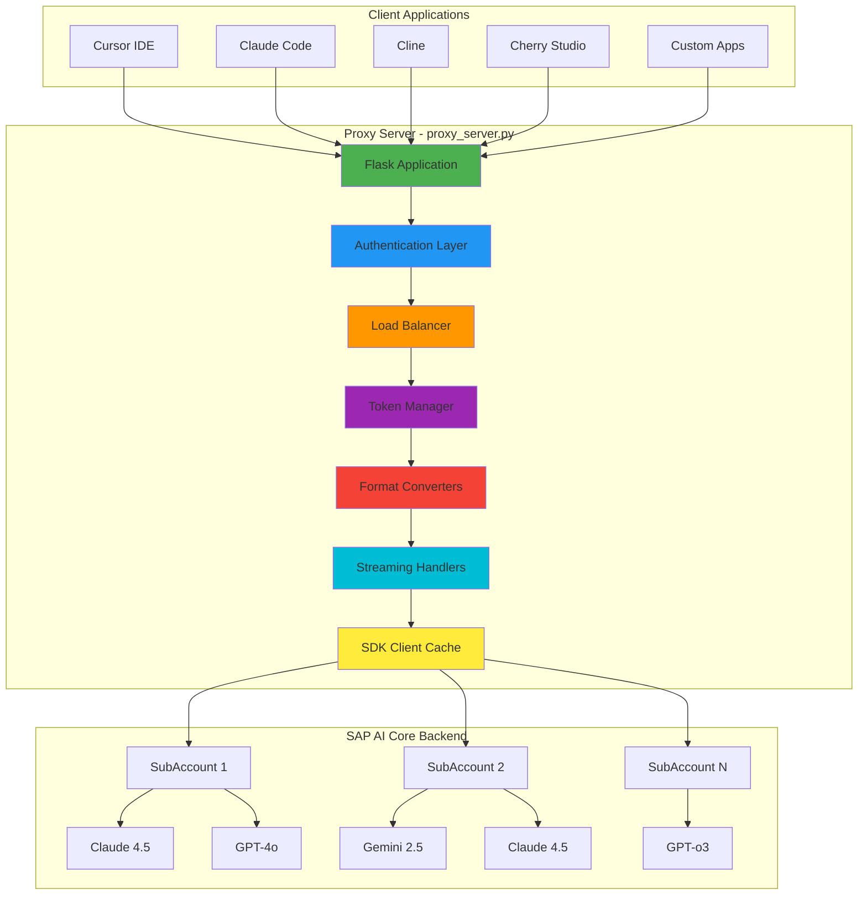
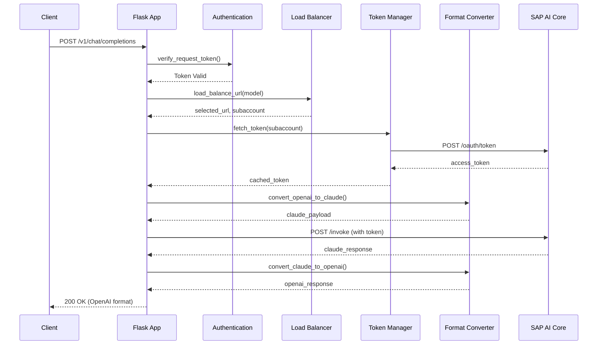
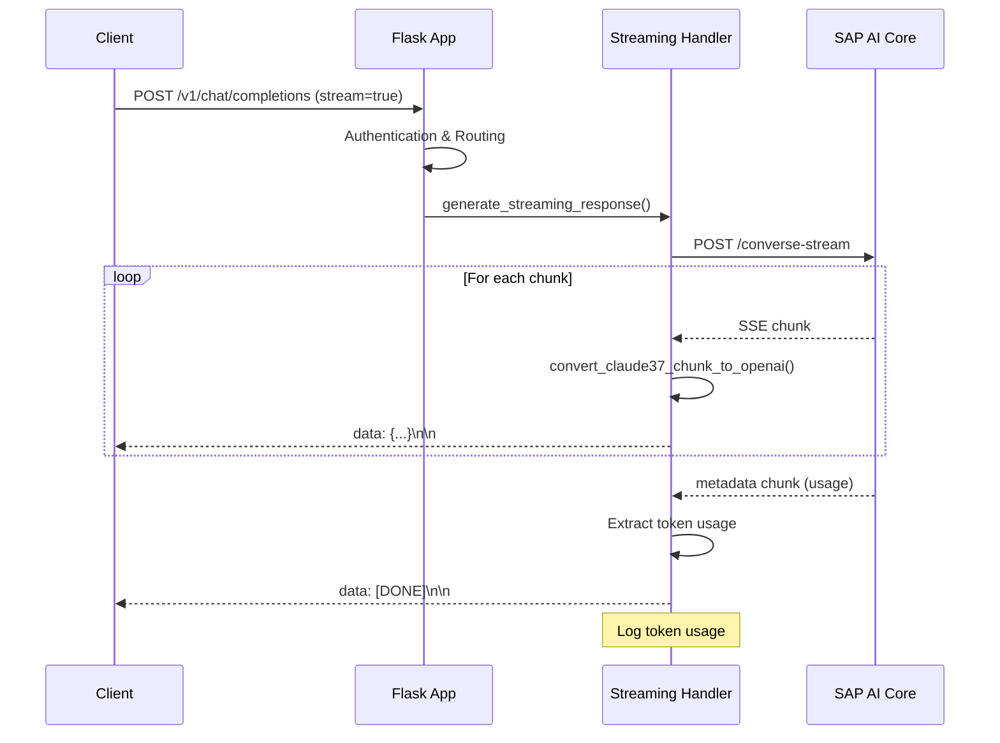
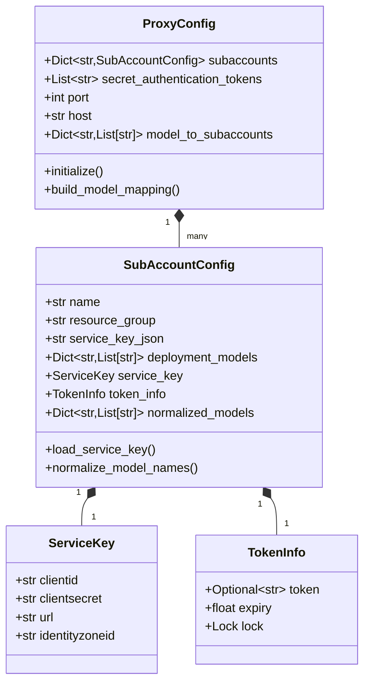
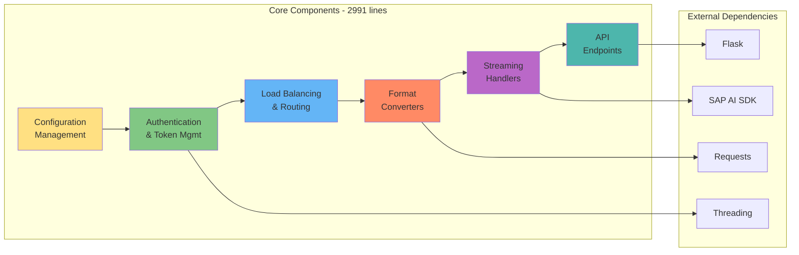
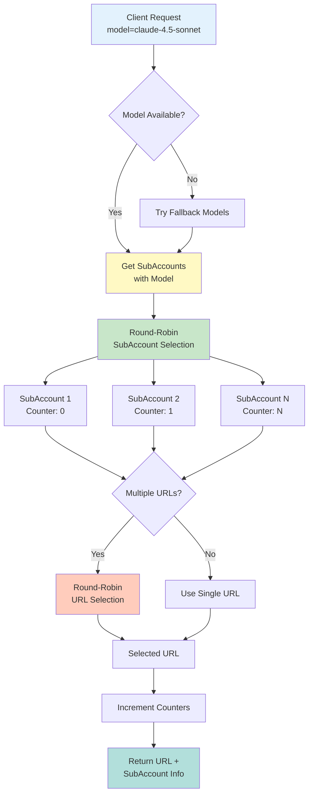
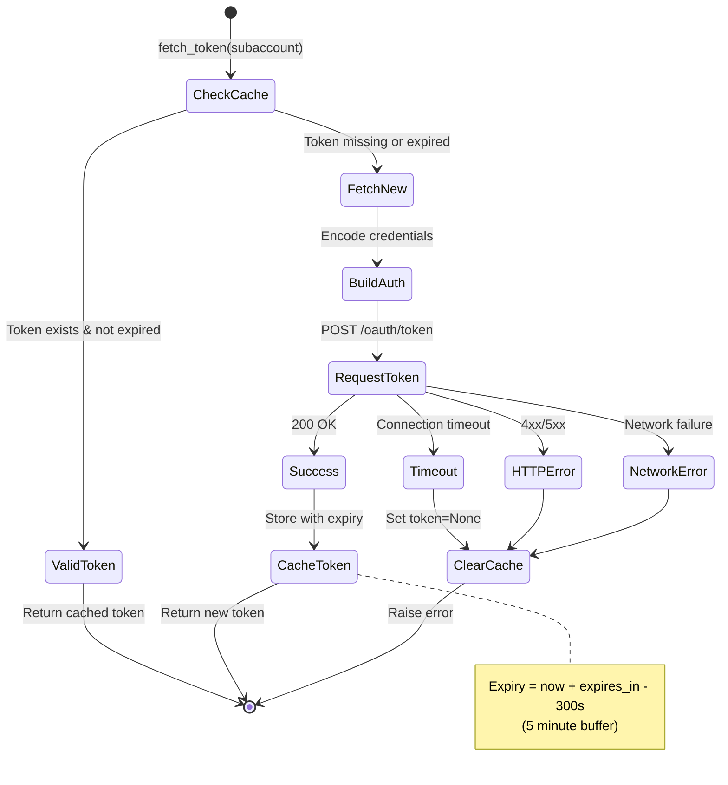
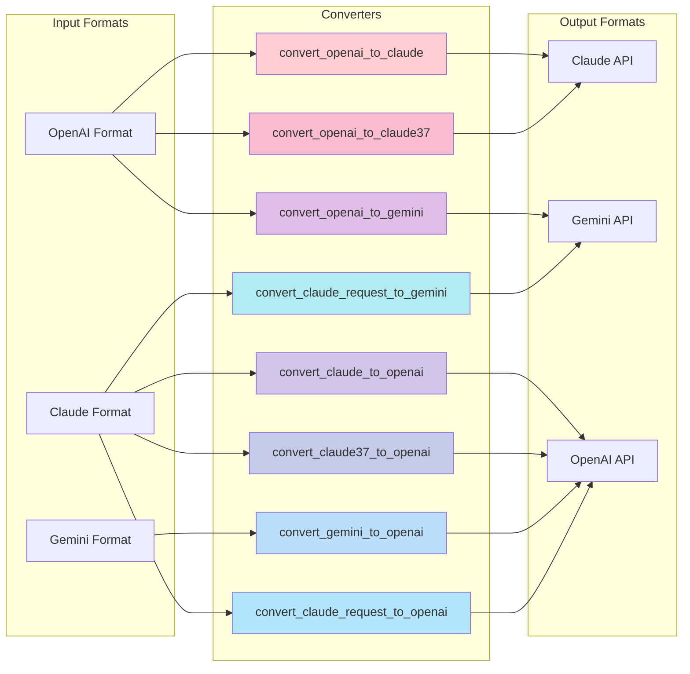
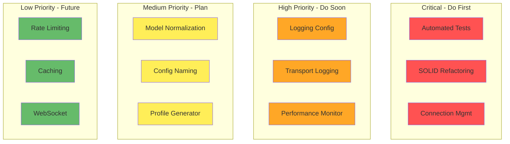

# SAP AI Core LLM Proxy - Architecture Documentation

**Version**: 0.1.16  
**Last Updated**: 2025-12-13  
**Status**: Production

---

## Table of Contents

1. [System Overview](#system-overview)
2. [Architecture Diagrams](#architecture-diagrams)
3. [Current Problems](#current-problems)
4. [Technical Debt](#technical-debt)
5. [Backlog Summary](#backlog-summary)

---

## System Overview

The SAP AI Core LLM Proxy is a Flask-based proxy server that transforms SAP AI Core LLM APIs into OpenAI-compatible APIs. It supports multiple model providers (Claude, Gemini, OpenAI) and implements load balancing across multiple SAP AI Core subaccounts.

### Key Features

- **Multi-Model Support**: Claude 4.x, Gemini 2.5, GPT-4o, GPT-o3
- **Multi-SubAccount Load Balancing**: Distributes requests across multiple SAP AI Core accounts
- **API Compatibility**: OpenAI Chat Completions API, Anthropic Messages API
- **Streaming Support**: Server-Sent Events (SSE) for real-time responses
- **Token Management**: Automatic token caching and refresh
- **Format Conversion**: Automatic request/response format conversion between providers

---

## Architecture Diagrams

### 1. System Architecture



### 2. Request Flow - OpenAI Chat Completions



### 3. Request Flow - Streaming



### 4. Data Model



### 5. Component Architecture



### 6. Load Balancing Strategy



### 7. Token Management Flow



### 8. Format Conversion Pipeline



---

## Current Problems

### 1. Monolithic Architecture (CRITICAL)

**Location**: [`proxy_server.py`](../proxy_server.py) (2991 lines)

**Issue**: Single file contains all functionality - configuration, authentication, routing, conversion, streaming, and API endpoints.

**Impact**:
- Difficult to maintain and test
- High coupling between components
- Hard to add new features
- Violates Single Responsibility Principle

**Evidence**:
```python
# All in one file:
- Configuration management (lines 23-95)
- Token management (lines 322-401)
- Authentication (lines 403-422)
- Format converters (lines 424-1592)
- Load balancing (lines 1593-1687)
- API endpoints (lines 1815-2331)
- Streaming handlers (lines 2411-2906)
```

### 2. Hardcoded Model Normalization (HIGH)

**Location**: [`proxy_server.py:56-67`](../proxy_server.py#L56-L67)

**Issue**: Model name normalization is disabled with hardcoded `if False:` statement.

```python
def normalize_model_names(self):
    """Normalize model names by removing prefixes like 'anthropic--'"""
    if False:  # ❌ Hardcoded - should be configurable
        self.normalized_models = {
            key.replace("anthropic--", ""): value
            for key, value in self.deployment_models.items()
        }
```

**Impact**:
- Cannot normalize model names without code changes
- Inconsistent model naming across deployments
- Requires code modification for different naming conventions

### 3. No Automated Testing (CRITICAL)

**Location**: Project-wide

**Issue**: Zero test coverage - no unit tests, integration tests, or API tests.

**Impact**:
- Cannot safely refactor code
- Risk of regressions with every change
- Difficult to validate bug fixes
- No confidence in deployments

**Missing Tests**:
- Configuration loading and validation
- Token management and caching
- Format conversion functions (8+ converters)
- Load balancing logic
- Streaming response handling
- API endpoint behavior

### 4. Inconsistent Configuration Naming (MEDIUM)

**Location**: [`proxy_server.py:316-320`](../proxy_server.py#L316-L320), `config.json`

**Issue**: Configuration file named `config.json` but should be `profile.json` for clarity.

**Impact**:
- Confusing naming convention
- Doesn't reflect multi-profile nature
- Inconsistent with industry standards

### 5. Limited Logging Configuration (HIGH)

**Location**: [`proxy_server.py:261-281`](../proxy_server.py#L261-L281)

**Issue**: Logging is hardcoded and not configurable.

```python
# Hardcoded logging setup
logging.basicConfig(level=logging.INFO, format='%(asctime)s - %(levelname)s - %(message)s')
```

**Impact**:
- Cannot adjust log levels without code changes
- No structured logging
- No log rotation configuration
- No separate log files for different components

### 6. No Connection Management (HIGH)

**Location**: Throughout request handling code

**Issue**: No connection pooling, retry logic, or circuit breaker pattern.

**Impact**:
- Poor performance (new connection per request)
- No automatic retry on transient failures
- No protection against cascading failures
- Hardcoded timeouts

### 7. Sensitive Data in Logs (SECURITY)

**Location**: Multiple logging statements

**Issue**: Tokens and credentials may be logged.

```python
logging.info(f"verify_request_token, Token received in request: {token[:15]}...")
```

**Impact**:
- Security risk if logs are compromised
- Compliance issues (GDPR, SOC2)
- No automatic redaction

### 8. No Health Monitoring (MEDIUM)

**Location**: Missing functionality

**Issue**: No health checks, metrics, or performance monitoring.

**Impact**:
- Cannot detect service degradation
- No visibility into backend performance
- Difficult to troubleshoot issues
- No alerting capabilities

---

## Technical Debt

### 1. SOLID Principles Violations

**Severity**: HIGH  
**Effort to Fix**: 2-4 weeks

**Violations**:

1. **Single Responsibility Principle (SRP)**
   - `proxy_server.py` handles 7+ responsibilities
   - Functions like `proxy_openai_stream()` (76 lines) do too much
   - `generate_streaming_response()` (258 lines) is too complex

2. **Open/Closed Principle (OCP)**
   - Adding new model providers requires modifying existing code
   - No plugin architecture for converters
   - Tightly coupled conversion logic

3. **Dependency Inversion Principle (DIP)**
   - Direct dependencies on Flask, requests, SAP SDK
   - No abstraction layer for external APIs
   - Hard to mock for testing

**Recommended Refactoring**:
```
src/
├── config/          # Configuration management
├── auth/            # Authentication & tokens
├── routing/         # Load balancing
├── converters/      # Format converters (pluggable)
├── streaming/       # Streaming handlers
├── api/             # API endpoints (Flask blueprints)
└── clients/         # External API clients
```

### 2. Global State Management

**Severity**: MEDIUM  
**Effort to Fix**: 1 week

**Issues**:
```python
# Global variables
proxy_config = ProxyConfig()  # Line 98
_sdk_session = None           # Line 107
_bedrock_clients = {}         # Line 109
token = None                  # Line 284
```

**Impact**:
- Thread safety concerns
- Difficult to test
- Hidden dependencies
- State pollution in tests

### 3. Error Handling Inconsistency

**Severity**: MEDIUM  
**Effort to Fix**: 1 week

**Issues**:
- Mix of exception types (ValueError, ConnectionError, RuntimeError)
- Inconsistent error response formats
- Some errors not logged properly
- No error categorization

**Example**:
```python
# Different error handling patterns
return jsonify({"error": "Unauthorized"}), 401
return jsonify({"type": "error", "error": {...}}), 400
raise ValueError("Model not found")
```

### 4. Code Duplication

**Severity**: MEDIUM  
**Effort to Fix**: 1-2 weeks

**Duplicated Logic**:
- Model type detection (`is_claude_model`, `is_gemini_model`, `is_claude_37_or_4`)
- Streaming chunk conversion (similar patterns for Claude/Gemini/OpenAI)
- Error handling in multiple endpoints
- Token usage logging (repeated 3+ times)

### 5. Magic Numbers and Strings

**Severity**: LOW  
**Effort to Fix**: 2-3 days

**Examples**:
```python
timeout=600                    # Should be configurable
backupCount=7                  # Should be in config
max_tokens=4096000            # Should be constant
"bedrock-2023-05-31"          # Should be constant
```

### 6. Incomplete Documentation

**Severity**: MEDIUM  
**Effort to Fix**: 1 week

**Missing**:
- API documentation (OpenAPI/Swagger)
- Architecture diagrams (now addressed in this document)
- Deployment guide
- Troubleshooting guide
- Performance tuning guide

### 7. No Observability

**Severity**: HIGH  
**Effort to Fix**: 2 weeks

**Missing**:
- Structured logging
- Distributed tracing
- Metrics collection (Prometheus)
- Performance profiling
- Request correlation IDs

---

## Backlog Summary

### High Priority (Must Have)

| # | Item | Effort | Risk | Impact |
|---|------|--------|------|--------|
| 1 | Fix Model Name Normalization | 1-3d | Low | Medium |
| 2 | Add Automated Test Cases | 2-4w | Low | Critical |
| 3 | Standardize Config File Naming | 1-3d | Medium | Low |
| 4 | Add Transport Logging | 1-2w | Low | High |
| 5 | Make Logging Configurable | 1-3d | Low | High |

**Total Effort**: ~5-7 weeks

### Medium Priority (Should Have)

| # | Item | Effort | Risk | Impact |
|---|------|--------|------|--------|
| 6 | Refactor to SOLID Principles | 2-4w | High | Critical |
| 7 | Generate profile.json Tool | 1-2w | Low | Medium |
| 8 | Abbreviated Request Logging | 1-3d | Low | Medium |
| 9 | Connection Management | 1-2w | Medium | High |
| 10 | Performance Monitoring | 1-2w | Low | High |

**Total Effort**: ~6-10 weeks

### Low Priority (Nice to Have)

| # | Item | Effort | Risk | Impact |
|---|------|--------|------|--------|
| 11 | Metrics & Monitoring | 1-2w | Low | Medium |
| 12 | Rate Limiting | 1-3d | Low | Medium |
| 13 | Request Caching | 1-2w | Medium | Medium |
| 14 | WebSocket Support | 2-4w | High | Low |

**Total Effort**: ~5-9 weeks

### Prioritization Matrix



### Recommended Implementation Order

**Phase 1: Foundation (Weeks 1-4)**
1. Add automated test framework and initial tests
2. Make logging configurable
3. Fix model name normalization

**Phase 2: Stability (Weeks 5-8)**
4. Implement connection management with retry logic
5. Add transport logging with rotation
6. Add performance monitoring

**Phase 3: Architecture (Weeks 9-16)**
7. Refactor to SOLID principles (incremental)
8. Standardize configuration naming
9. Create profile generator tool

**Phase 4: Enhancement (Weeks 17+)**
10. Add metrics and monitoring endpoints
11. Implement rate limiting
12. Add request caching
13. Consider WebSocket support

---

## Metrics & KPIs

### Current State

- **Lines of Code**: 2,991 (single file)
- **Test Coverage**: 0%
- **Cyclomatic Complexity**: High (functions >50 lines)
- **Technical Debt Ratio**: ~40% (estimated)
- **SOLID Compliance**: Low

### Target State (6 months)

- **Lines of Code**: <500 per file
- **Test Coverage**: >80%
- **Cyclomatic Complexity**: Medium (functions <30 lines)
- **Technical Debt Ratio**: <15%
- **SOLID Compliance**: High

---

## Conclusion

The SAP AI Core LLM Proxy is a functional system that successfully bridges multiple LLM providers with SAP AI Core. However, it suffers from significant technical debt due to its monolithic architecture and lack of testing.

**Key Recommendations**:

1. **Immediate**: Add automated tests to prevent regressions
2. **Short-term**: Implement connection management and monitoring
3. **Medium-term**: Refactor to SOLID principles for maintainability
4. **Long-term**: Add advanced features (caching, rate limiting, WebSocket)

**Success Criteria**:
- All critical paths have test coverage
- Code is organized into logical modules
- Performance is monitored and optimized
- System is production-ready with proper observability

---

**Document Version**: 1.0  
**Next Review**: 2025-01-13  
**Maintained By**: Architecture Team