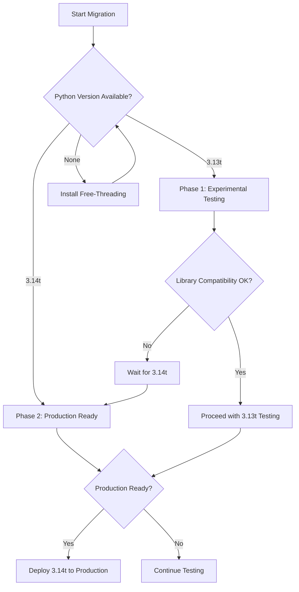

# Free-Threading Quick Reference Guide
## Python 3.13/3.14 for SAP AI Core LLM Proxy

**Version:** 1.0  
**Date:** 2025-12-18  
**Target:** Development team reference for free-threading migration  

## Quick Commands

### Environment Setup
```bash
# Check if free-threaded Python is available
python3.13t --version  # Python 3.13t
python3.14t --version  # Python 3.14t (when available)

# Verify GIL status
python3.13t -c "import sys; print(f'GIL: {\"Enabled\" if sys._is_gil_enabled() else \"Disabled\"}')"

# Disable GIL at runtime
PYTHON_GIL=0 python3.13t script.py
python3.13t -X gil=0 script.py

# Enable GIL (for compatibility testing)
PYTHON_GIL=1 python3.13t script.py
python3.13t -X gil=1 script.py
```

### Performance Testing
```bash
# Run comprehensive benchmark
./scripts/benchmark_free_threading.sh

# Quick performance test
python3.13t -c "
import time
from concurrent.futures import ThreadPoolExecutor
import sys

def cpu_task():
    total = sum(i*i for i in range(100000))
    return total

# Single-threaded
start = time.time()
result1 = cpu_task()
single_time = time.time() - start

# Multi-threaded  
start = time.time()
with ThreadPoolExecutor(max_workers=4) as executor:
    futures = [executor.submit(cpu_task) for _ in range(4)]
    results = [f.result() for f in futures]
multi_time = time.time() - start

print(f'GIL: {sys._is_gil_enabled()}')
print(f'Single: {single_time:.3f}s, multi: {multi_time:.3f}s')
print(f'Speedup: {single_time/multi_time:.2f}x')
"
```

## Expected Performance Gains

| Operation Type | Current (GIL) | Free-Threading | Improvement |
|--------------|----------------|----------------|-------------|
| Concurrent HTTP Requests | 1x | 3-5x | 300-500% |
| Streaming Responses | Sequential | Parallel | 200-800% |
| SDK Client Operations | Serialized | Concurrent | 150-300% |
| Load Balancing | Round-robin | True parallel | 200-400% |

## Library Compatibility Matrix

| Library | Status | Version | Notes |
|---------|--------|---------|-------|
| Flask | ✅ Compatible | 3.1.2+ | No changes needed |
| requests | ✅ Compatible | latest | Pure Python |
| urllib3 | ✅ Compatible | 2.6.0+ | Thread-safe pooling |
| ai-core-sdk | 🔄 Test needed | 2.6.2+ | Needs validation |
| sap-ai-sdk-gen | 🔄 Test needed | 5.8.0+ | Needs validation |
| cryptography | ⚠️ 3.13t Issue | current | Fixed in 3.14t |
| openai | ✅ Likely compatible | 2.8.0+ | Test recommended |
| litellm | ✅ Likely compatible | 1.79.3+ | Test recommended |

## Code Changes Required

### 1. Flask Deployment
```python
# Current (development server)
app.run(host=host, port=port, debug=args.debug)

# Recommended (production with free-threading)
# Gunicorn with optimized workers
gunicorn --workers 4 --threads 8 --bind 0.0.0.0:8000 proxy_server:app
```

### 2. Thread Safety Verification
```python
# Review existing patterns - these are already good
import threading

# ✅ Already implemented correctly
_sdk_session_lock = threading.Lock()
_bedrock_clients_lock = threading.Lock()

# ✅ Token manager locks are thread-safe
class TokenManager:
    def __init__(self):
        self._lock = threading.Lock()
    
    def get_token(self):
        with self._lock:  # Thread-safe token access
            return self._token
```

### 3. Enhanced Monitoring
```python
# Add free-threading metrics
import sys
import threading
import time

def log_free_threading_metrics():
    gil_enabled = sys._is_gil_enabled()
    active_threads = threading.active_count()
    
    print(f"GIL Status: {'Enabled' if gil_enabled else 'Disabled'}")
    print(f"Active Threads: {active_threads}")
    print(f"CPU Cores Utilized: {min(active_threads, 4)}/4")
    
    # Add to existing logging
    logging.info(f"Free-threading metrics - GIL: {gil_enabled}, Threads: {active_threads}")
```

## Testing Checklist

### Pre-Migration Tests
- [ ] Install Python 3.13t/3.14t
- [ ] Verify GIL is disabled (`sys._is_gil_enabled()`)
- [ ] Test all dependencies with free-threading
- [ ] Run baseline performance tests
- [ ] Validate SAP AI SDK compatibility

### Post-Migration Tests
- [ ] Run load tests with 4+ concurrent requests
- [ ] Test streaming responses with multiple clients
- [ ] Verify SDK client caching under concurrency
- [ ] Monitor memory usage patterns
- [ ] Test error handling and recovery

### Performance Targets
- [ ] 3x+ improvement in concurrent request throughput
- [ ] 30%+ reduction in average response latency
- [ ] 70%+ CPU utilization on multi-core systems
- [ ] <0.1% error rate under 2x load
- [ ] Successful rollback in <5 minutes if needed

## Common Issues & Solutions

### Issue 1: Cryptography Import Error
```bash
# Python 3.13t with cryptography < 3.5
ImportError: cannot import name '_cffi_backend' from 'cryptography'

# Solution: Upgrade cryptography
pip install --upgrade cryptography>=3.5.0

# Or use Python 3.14t (recommended)
python3.14t -m venv venv-ft
source venv-ft/bin/activate
pip install -r requirements.txt
```

### Issue 2: SAP SDK Thread Safety
```python
# If encountering race conditions
# Add additional locking around shared resources
class EnhancedSDKClientManager:
    def __init__(self):
        self._clients = {}
        self._locks = {}  # Per-model locks
    
    def get_client(self, model):
        if model not in self._locks:
            self._locks[model] = threading.Lock()
        
        with self._locks[model]:
            if model not in self._clients:
                self._clients[model] = self._create_client(model)
            return self._clients[model]
```

### Issue 3: Performance Regression
```bash
# If free-threading is slower
# Check if GIL is actually disabled
python -c "import sys; print('GIL Status:', 'Enabled' if sys._is_gil_enabled() else 'Disabled')"

# If still enabled, force disable
export PYTHON_GIL=0
python -X gil=0 script.py
```

## Migration Decision Tree



## Monitoring Metrics

### Key Performance Indicators
```python
# Add to existing monitoring
FREE_THREADING_METRICS = {
    'concurrent_requests': 'gauge',
    'thread_utilization': 'histogram', 
    'gil_contention_ratio': 'counter',
    'stream_throughput': 'gauge',
    'sdk_client_reuse_rate': 'gauge'
}
```

### Alert Thresholds
- **Thread Utilization < 50%**: Potential configuration issue
- **GIL Contention > 10%**: Mixed environment issue
- **Stream Throughput Drop > 20%**: Performance regression
- **SDK Client Reuse < 60%**: Resource inefficiency

## Rollback Plan

### Quick Rollback (<5 minutes)
```bash
# Emergency rollback script
#!/bin/bash
echo "🚨 Emergency rollback initiated"

# Switch to standard Python
conda activate python-standard  # or equivalent
export PYTHON_GIL=1

# Restart with standard configuration
gunicorn --workers 1 --threads 1 proxy_server:app

echo "✅ Rollback complete"
```

### Verification
```bash
# Verify rollback
python -c "import sys; print('GIL Enabled:', sys._is_gil_enabled())"

# Test basic functionality
curl -X POST http://localhost:8000/v1/models \
  -H "Content-Type: application/json" \
  -H "Authorization: Bearer test-token"
```

## Resources

### Documentation Links
- [PEP 703 - Making the GIL Optional](https://peps.python.org/pep-0703/)
- [PEP 779 - Free-Threading Support Criteria](https://peps.python.org/pep-0779/)
- [Python Free-Threading Documentation](https://py-free-threading.github.io/)
- [SAP AI SDK Documentation](https://help.sap.com/doc/)

### Community Support
- Python Discourse: Free-threading tag
- Stack Overflow: python-free-threading tag
- SAP Community: AI Core SDK discussions

---

**Quick Decision Guide:**
- **For immediate testing**: Use Python 3.13t
- **For production deployment**: Wait for Python 3.14t
- **For maximum benefit**: Deploy with production WSGI server and monitoring
- **For safety**: Maintain rollback capability and gradual migration