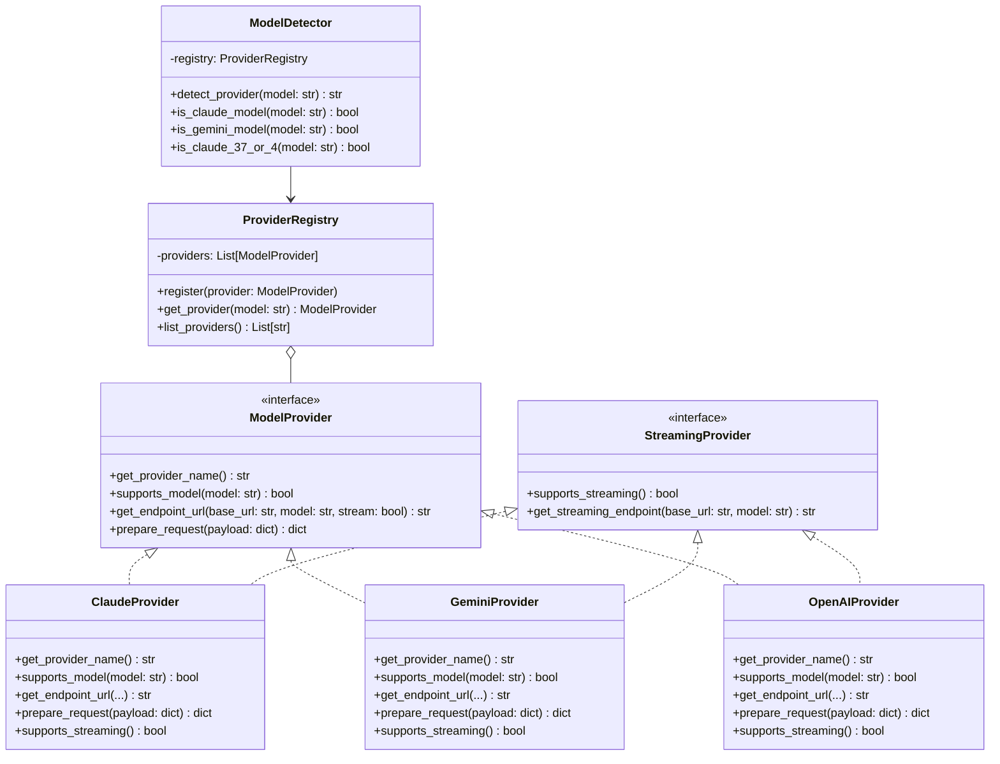

# Phase 4: Model Provider Abstraction - Implementation Plan

## Executive Summary

**Phase**: 4 of 7  
**Goal**: Extract model detection and provider logic into a modular, extensible architecture  
**Duration**: 5-7 days  
**Status**: 🔄 In Planning  
**Dependencies**: Phase 3 (Authentication Module) ✅ Complete

---

## Table of Contents

1. [Overview](#overview)
2. [Current State Analysis](#current-state-analysis)
3. [Target Architecture](#target-architecture)
4. [Implementation Tasks](#implementation-tasks)
5. [File Specifications](#file-specifications)
6. [Testing Strategy](#testing-strategy)
7. [Migration Path](#migration-path)
8. [Success Criteria](#success-criteria)

---

## Overview

### Objectives

1. **Extract Model Detection Logic**: Move `is_claude_model()`, `is_gemini_model()`, `is_claude_37_or_4()` to dedicated module
2. **Create Provider Abstraction**: Define base interfaces for model providers (Strategy Pattern)
3. **Implement Provider Classes**: Create Claude, Gemini, and OpenAI provider implementations
4. **Build Provider Registry**: Enable dynamic provider registration (Open/Closed Principle)
5. **Maintain Backward Compatibility**: Ensure existing code continues to work

### SOLID Principles Addressed

- ✅ **Single Responsibility**: Each provider handles one model type
- ✅ **Open/Closed**: Easy to add new providers without modifying existing code
- ✅ **Liskov Substitution**: All providers implement common interface
- ✅ **Interface Segregation**: Separate interfaces for streaming vs non-streaming
- ✅ **Dependency Inversion**: High-level code depends on provider abstractions

---

## Current State Analysis

### Existing Code Locations (proxy_server.py)

| Function | Lines | Responsibility | Target Module |
|----------|-------|----------------|---------------|
| `is_claude_model()` | 797-798 | Detect Claude models | `models/detector.py` |
| `is_claude_37_or_4()` | 800-810 | Detect Claude 3.7/4/4.5 | `models/detector.py` |
| `is_gemini_model()` | 812-822 | Detect Gemini models | `models/detector.py` |
| `handle_claude_request()` | 1434-1477 | Claude request handling | `models/claude_provider.py` |
| `handle_gemini_request()` | 1479-1517 | Gemini request handling | `models/gemini_provider.py` |
| `handle_default_request()` | 1519-1558 | OpenAI request handling | `models/openai_provider.py` |

### Current Detection Logic

```python
# Lines 797-822 in proxy_server.py
def is_claude_model(model):
    return any(keyword in model for keyword in ["claude", "clau", "claud", "sonnet", "sonne", "sonn", "CLAUDE", "SONNET"])

def is_claude_37_or_4(model):
    return any(version in model for version in ["3.7", "4", "4.5"]) or "3.5" not in model

def is_gemini_model(model):
    return any(keyword in model.lower() for keyword in ["gemini", "gemini-1.5", "gemini-2.5", "gemini-pro", "gemini-flash"])
```

### Issues with Current Implementation

1. **Hardcoded Detection**: Model detection uses string matching, not extensible
2. **Scattered Logic**: Request handling logic duplicated across functions
3. **No Abstraction**: Direct coupling between routing and model-specific code
4. **Difficult to Test**: Model-specific logic mixed with request handling
5. **OCP Violation**: Adding new model requires modifying multiple functions

---

## Target Architecture

### Module Structure

```
models/
├── __init__.py              # Public API exports
├── detector.py              # ModelDetector class
├── provider.py              # Base interfaces (ModelProvider, StreamingProvider)
├── claude_provider.py       # Claude implementation
├── gemini_provider.py       # Gemini implementation
├── openai_provider.py       # OpenAI implementation
└── registry.py              # ProviderRegistry for dynamic registration
```

### Class Hierarchy



---

## Implementation Tasks

### Task 1: Create Package Structure (Day 1, 1 hour)

**Files to Create**:
- `models/__init__.py`

**Actions**:
```bash
mkdir -p models
touch models/__init__.py
```

**Acceptance Criteria**:
- [ ] `models/` directory exists
- [ ] `__init__.py` created with proper imports
- [ ] Package importable from proxy_server.py

---

### Task 2: Implement ModelDetector (Day 1, 3 hours)

**File**: `models/detector.py` (~150 lines)

**Responsibilities**:
- Extract model type detection logic
- Provide backward-compatible detection functions
- Integrate with ProviderRegistry

**Key Methods**:
```python
class ModelDetector:
    def __init__(self, registry: Optional[ProviderRegistry] = None)
    def detect_provider(self, model: str) -> str
    def is_claude_model(self, model: str) -> bool
    def is_gemini_model(self, model: str) -> bool
    def is_claude_37_or_4(self, model: str) -> bool
    def get_model_version(self, model: str) -> Optional[str]
```

**Test Coverage**: 80%+ (15-20 test cases)

---

### Task 3: Implement Base Provider Interface (Day 1-2, 4 hours)

**File**: `models/provider.py` (~200 lines)

**Responsibilities**:
- Define `ModelProvider` protocol/ABC
- Define `StreamingProvider` protocol
- Define data classes for requests/responses

**Key Classes**:
```python
@dataclass
class ModelRequest:
    model: str
    messages: list
    temperature: Optional[float] = None
    max_tokens: Optional[int] = None
    stream: bool = False
    extra_params: Dict[str, Any] = field(default_factory=dict)

@dataclass
class ModelResponse:
    content: str
    model: str
    finish_reason: str
    usage: Dict[str, int]
    raw_response: Dict[str, Any]

class ModelProvider(ABC):
    @abstractmethod
    def get_provider_name(self) -> str: ...
    
    @abstractmethod
    def supports_model(self, model: str) -> bool: ...
    
    @abstractmethod
    def get_endpoint_url(self, base_url: str, model: str, stream: bool) -> str: ...
    
    @abstractmethod
    def prepare_request(self, payload: dict) -> dict: ...

class StreamingProvider(ABC):
    @abstractmethod
    def supports_streaming(self) -> bool: ...
    
    @abstractmethod
    def get_streaming_endpoint(self, base_url: str, model: str) -> str: ...
```

**Test Coverage**: 90%+ (interface validation)

---

### Task 4: Implement ClaudeProvider (Day 2, 4 hours)

**File**: `models/claude_provider.py` (~200 lines)

**Responsibilities**:
- Claude model detection (including 3.7/4/4.5 variants)
- Endpoint URL generation (`/invoke`, `/converse`, `/converse-stream`)
- Request payload preparation (no conversion, just routing)

**Key Features**:
- Support for Claude 3.5, 3.7, 4, 4.5
- Streaming endpoint selection based on version
- Model name normalization (handle `anthropic--` prefix)

**Test Coverage**: 85%+ (20-25 test cases)

---

### Task 5: Implement GeminiProvider (Day 2-3, 4 hours)

**File**: `models/gemini_provider.py` (~180 lines)

**Responsibilities**:
- Gemini model detection (1.5, 2.5, pro, flash variants)
- Endpoint URL generation (`/models/{model}:generateContent`)
- Streaming endpoint support

**Key Features**:
- Support for Gemini 1.5, 2.5, Pro, Flash
- Model endpoint name extraction
- Streaming vs non-streaming endpoint selection

**Test Coverage**: 85%+ (15-20 test cases)

---

### Task 6: Implement OpenAIProvider (Day 3, 3 hours)

**File**: `models/openai_provider.py` (~150 lines)

**Responsibilities**:
- OpenAI/Azure OpenAI model detection
- Endpoint URL generation with API version
- Special handling for o3/o4-mini models

**Key Features**:
- Support for GPT-4, GPT-5, o3, o4-mini
- API version selection (2023-05-15 vs 2024-12-01-preview)
- Parameter filtering for o3-mini (remove temperature)

**Test Coverage**: 85%+ (15-20 test cases)

---

### Task 7: Implement ProviderRegistry (Day 3-4, 4 hours)

**File**: `models/registry.py` (~150 lines)

**Responsibilities**:
- Provider registration and lookup
- Thread-safe provider management
- Fallback provider selection

**Key Methods**:
```python
class ProviderRegistry:
    def __init__(self)
    def register(self, provider: ModelProvider) -> None
    def get_provider(self, model: str) -> Optional[ModelProvider]
    def list_providers(self) -> List[str]
    def get_all_providers(self) -> List[ModelProvider]
```

**Features**:
- Singleton pattern for global registry
- Auto-registration decorator
- Provider priority/ordering

**Test Coverage**: 90%+ (10-15 test cases)

---

### Task 8: Write Comprehensive Tests (Day 4-5, 8 hours)

**Test Files**:
- `tests/unit/test_models/test_detector.py` (~200 lines, 15-20 tests)
- `tests/unit/test_models/test_claude_provider.py` (~250 lines, 20-25 tests)
- `tests/unit/test_models/test_gemini_provider.py` (~200 lines, 15-20 tests)
- `tests/unit/test_models/test_openai_provider.py` (~200 lines, 15-20 tests)
- `tests/unit/test_models/test_registry.py` (~150 lines, 10-15 tests)

**Test Categories**:
1. **Model Detection Tests**: Verify correct provider identification
2. **Endpoint Generation Tests**: Validate URL construction
3. **Request Preparation Tests**: Check payload handling
4. **Registry Tests**: Provider registration and lookup
5. **Edge Cases**: Invalid models, missing providers, fallbacks

**Coverage Target**: 85%+ overall

---

### Task 9: Update proxy_server.py Integration (Day 5-6, 6 hours)

**Changes Required**:

1. **Import new modules**:
```python
from models import ModelDetector, ProviderRegistry, ClaudeProvider, GeminiProvider, OpenAIProvider
```

2. **Initialize registry** (at module level):
```python
# Initialize provider registry
provider_registry = ProviderRegistry()
provider_registry.register(ClaudeProvider())
provider_registry.register(GeminiProvider())
provider_registry.register(OpenAIProvider())

# Initialize detector
model_detector = ModelDetector(provider_registry)
```

3. **Update request handlers** (lines 1669-1676):
```python
# OLD:
if is_claude_model(model):
    endpoint_url, modified_payload, subaccount_name = handle_claude_request(payload, model)
elif is_gemini_model(model):
    endpoint_url, modified_payload, subaccount_name = handle_gemini_request(payload, model)
else:
    endpoint_url, modified_payload, subaccount_name = handle_default_request(payload, model)

# NEW:
provider = provider_registry.get_provider(model)
if not provider:
    return jsonify({"error": f"No provider found for model '{model}'"}), 400

selected_url, subaccount_name, _, model = load_balance_url(model)
endpoint_url = provider.get_endpoint_url(selected_url, model, payload.get("stream", False))
modified_payload = provider.prepare_request(payload)
```

4. **Add backward-compatible functions**:

```python
# Backward compatibility wrappers
import proxy_helpers


def is_claude_model(model: str) -> bool:
    """Deprecated: Use ModelDetector.is_claude_model()"""
    return proxy_helpers.is_claude_model(model)


def is_gemini_model(model: str) -> bool:
    """Deprecated: Use ModelDetector.is_gemini_model()"""
    return proxy_helpers.is_gemini_model(model)


def is_claude_37_or_4(model: str) -> bool:
    """Deprecated: Use ModelDetector.is_claude_37_or_4()"""
    return proxy_helpers.is_claude_37_or_4(model)
```

**Lines to Remove**: ~300 lines (detection functions + handler functions)

---

### Task 10: Integration Testing (Day 6-7, 4 hours)

**Test Scenarios**:
1. ✅ Claude 3.5 non-streaming request
2. ✅ Claude 3.7 streaming request
3. ✅ Claude 4.5 with thinking mode
4. ✅ Gemini 2.5 non-streaming request
5. ✅ Gemini streaming request
6. ✅ OpenAI GPT-4o request
7. ✅ OpenAI o3-mini request (temperature removed)
8. ✅ Model fallback scenarios
9. ✅ Invalid model handling
10. ✅ Multi-subaccount load balancing

**Acceptance Criteria**:
- [ ] All existing tests pass
- [ ] No regressions in functionality
- [ ] Performance within 5% of baseline
- [ ] Backward compatibility maintained

---

## File Specifications

### models/__init__.py

```python
"""
Model provider abstraction module.

This module provides a clean abstraction for different AI model providers
(Claude, Gemini, OpenAI) following the Strategy pattern.
"""

from .detector import ModelDetector
from .provider import ModelProvider, StreamingProvider, ModelRequest, ModelResponse
from .claude_provider import ClaudeProvider
from .gemini_provider import GeminiProvider
from .openai_provider import OpenAIProvider
from .registry import ProviderRegistry

__all__ = [
    "ModelDetector",
    "ModelProvider",
    "StreamingProvider",
    "ModelRequest",
    "ModelResponse",
    "ClaudeProvider",
    "GeminiProvider",
    "OpenAIProvider",
    "ProviderRegistry",
]
```

### models/detector.py (Detailed Specification)

```python
"""Model detection and provider identification."""

import logging
from typing import Optional
from .registry import ProviderRegistry


class ModelDetector:
    """Detects model types and identifies appropriate providers.
    
    Features:
    - Provider-based detection using registry
    - Backward-compatible detection functions
    - Version detection for Claude models
    """
    
    def __init__(self, registry: Optional[ProviderRegistry] = None):
        """Initialize detector with provider registry.
        
        Args:
            registry: ProviderRegistry instance (creates default if None)
        """
        self.registry = registry or ProviderRegistry()
        self._logger = logging.getLogger(__name__)
    
    def detect_provider(self, model: str) -> Optional[str]:
        """Detect which provider supports the given model.
        
        Args:
            model: Model name to detect
            
        Returns:
            Provider name or None if no provider found
        """
        provider = self.registry.get_provider(model)
        return provider.get_provider_name() if provider else None
    
    def is_claude_model(self, model: str) -> bool:
        """Check if model is a Claude model.
        
        Supports detection of:
        - claude-3.5-sonnet
        - claude-3.7-sonnet
        - claude-4-sonnet, claude-4-opus
        - claude-4.5-sonnet
        - anthropic-- prefixed variants
        - Partial names (clau, claud, sonnet, etc.)
        
        Args:
            model: Model name to check
            
        Returns:
            True if Claude model, False otherwise
        """
        keywords = ["claude", "clau", "claud", "sonnet", "sonne", "sonn"]
        return any(keyword in model.lower() for keyword in keywords)
    
    def is_gemini_model(self, model: str) -> bool:
        """Check if model is a Gemini model.
        
        Supports detection of:
        - gemini-1.5-pro, gemini-1.5-flash
        - gemini-2.5-pro, gemini-2.5-flash
        - gemini-pro, gemini-flash
        
        Args:
            model: Model name to check
            
        Returns:
            True if Gemini model, False otherwise
        """
        keywords = ["gemini", "gemini-1.5", "gemini-2.5", "gemini-pro", "gemini-flash"]
        return any(keyword in model.lower() for keyword in keywords)
    
    def is_claude_37_or_4(self, model: str) -> bool:
        """Check if model is Claude 3.7, 4, or 4.5.
        
        These versions use different endpoints (/converse vs /invoke).
        
        Args:
            model: Model name to check
            
        Returns:
            True if Claude 3.7/4/4.5, False otherwise
        """
        # Check for explicit version numbers
        if any(version in model for version in ["3.7", "4", "4.5"]):
            return True
        
        # If it's a Claude model but doesn't contain "3.5", assume newer version
        if self.is_claude_model(model) and "3.5" not in model:
            return True
        
        return False
    
    def get_model_version(self, model: str) -> Optional[str]:
        """Extract version number from model name.
        
        Args:
            model: Model name
            
        Returns:
            Version string (e.g., "3.5", "4", "4.5") or None
        """
        import re
        
        # Try to extract version pattern like "3.5", "4", "4.5"
        version_match = re.search(r'(\d+(?:\.\d+)?)', model)
        if version_match:
            return version_match.group(1)
        
        return None


# Backward compatibility: Module-level functions
_default_detector = None

def get_default_detector() -> ModelDetector:
    """Get or create default detector instance."""
    global _default_detector
    if _default_detector is None:
        _default_detector = ModelDetector()
    return _default_detector


def is_claude_model(model: str) -> bool:
    """Backward compatible function for Claude detection."""
    return get_default_detector().is_claude_model(model)


def is_gemini_model(model: str) -> bool:
    """Backward compatible function for Gemini detection."""
    return get_default_detector().is_gemini_model(model)


def is_claude_37_or_4(model: str) -> bool:
    """Backward compatible function for Claude 3.7/4 detection."""
    return get_default_detector().is_claude_37_or_4(model)
```

---

## Testing Strategy

### Unit Test Structure

```
tests/unit/test_models/
├── __init__.py
├── test_detector.py          # ModelDetector tests
├── test_claude_provider.py   # ClaudeProvider tests
├── test_gemini_provider.py   # GeminiProvider tests
├── test_openai_provider.py   # OpenAIProvider tests
└── test_registry.py          # ProviderRegistry tests
```

### Test Coverage Goals

| Module | Target Coverage | Test Count |
|--------|----------------|------------|
| detector.py | 90% | 15-20 |
| provider.py | 95% | 10-15 |
| claude_provider.py | 85% | 20-25 |
| gemini_provider.py | 85% | 15-20 |
| openai_provider.py | 85% | 15-20 |
| registry.py | 90% | 10-15 |
| **Overall** | **85%+** | **85-115** |

### Key Test Scenarios

#### ModelDetector Tests
- ✅ Detect Claude models (various formats)
- ✅ Detect Gemini models (various formats)
- ✅ Detect Claude 3.7/4/4.5 versions
- ✅ Handle invalid/unknown models
- ✅ Extract version numbers
- ✅ Provider lookup via registry

#### Provider Tests (per provider)
- ✅ Model support detection
- ✅ Endpoint URL generation (streaming/non-streaming)
- ✅ Request payload preparation
- ✅ API version selection
- ✅ Model name normalization
- ✅ Edge cases (missing parameters, invalid models)

#### Registry Tests
- ✅ Provider registration
- ✅ Provider lookup by model
- ✅ Multiple provider registration
- ✅ Provider priority/ordering
- ✅ Thread safety
- ✅ Fallback behavior

---

## Migration Path

### Phase 1: Create New Modules (No Breaking Changes)

**Duration**: Day 1-3

1. Create `models/` package
2. Implement all provider classes
3. Implement detector and registry
4. Write comprehensive tests
5. **Do not modify proxy_server.py yet**

**Validation**: All new tests pass, no impact on existing code

---

### Phase 2: Add Backward-Compatible Wrappers (No Breaking Changes)

**Duration**: Day 4

1. Add module-level detection functions in `models/detector.py`
2. Import new modules in `proxy_server.py`
3. Initialize registry at module level
4. **Keep existing functions in proxy_server.py**

**Validation**: Existing tests still pass, new modules importable

---

### Phase 3: Update Request Handlers (Controlled Migration)

**Duration**: Day 5-6

1. Update `proxy_openai_stream()` to use provider registry
2. Update `proxy_claude_request()` to use provider registry
3. Add deprecation warnings to old functions
4. Run full integration test suite

**Validation**: All tests pass, no regressions

---

### Phase 4: Remove Legacy Code (Breaking Changes)

**Duration**: Day 7

1. Remove old detection functions from `proxy_server.py`
2. Remove old handler functions (`handle_claude_request`, etc.)
3. Update all internal references
4. Final integration testing

**Validation**: Code cleaner, tests pass, documentation updated

---

## Success Criteria

### Functional Requirements

- [x] All model detection logic extracted to `models/` module
- [ ] Provider abstraction implemented with base interfaces
- [ ] Claude, Gemini, OpenAI providers implemented
- [ ] Provider registry supports dynamic registration
- [ ] Backward compatibility maintained during transition
- [ ] All existing tests pass without modification
- [ ] New unit tests achieve 85%+ coverage

### Non-Functional Requirements

- [ ] No performance regression (±5% baseline)
- [ ] Memory usage unchanged (±10% baseline)
- [ ] Code complexity reduced (cyclomatic complexity <10)
- [ ] Easy to add new providers (OCP compliance)
- [ ] Clear documentation for provider implementation

### Code Quality Metrics

| Metric | Before | Target | Measurement |
|--------|--------|--------|-------------|
| Lines in proxy_server.py | 2,806 | 2,500 | -300 lines |
| Model detection complexity | High | Low | Extracted |
| Provider coupling | Tight | Loose | Abstracted |
| Test coverage (models) | 0% | 85%+ | New tests |
| Cyclomatic complexity | 15+ | <10 | Per function |

---

## Risk Assessment

### High Risk

**Risk**: Breaking existing model detection logic  
**Mitigation**: Comprehensive backward compatibility tests, gradual migration  
**Contingency**: Keep old functions as fallback during transition

**Risk**: Performance regression from abstraction layers  
**Mitigation**: Benchmark before/after, optimize hot paths  
**Contingency**: Cache provider lookups, lazy initialization

### Medium Risk

**Risk**: Incomplete provider implementations  
**Mitigation**: Test all model variants, edge cases  
**Contingency**: Fallback to legacy implementation if provider fails

**Risk**: Registry thread-safety issues  
**Mitigation**: Use thread-safe data structures, add concurrency tests  
**Contingency**: Add locks around critical sections

### Low Risk

**Risk**: Import path changes breaking external code  
**Mitigation**: Maintain backward-compatible imports  
**Contingency**: Document migration path clearly

---

## Timeline

```
Week 1 (Days 1-3): Core Implementation
├── Day 1: Package structure + ModelDetector + Base interfaces
├── Day 2: ClaudeProvider + GeminiProvider
└── Day 3: OpenAIProvider + ProviderRegistry

Week 2 (Days 4-7): Testing & Integration
├── Day 4: Unit tests for all modules
├── Day 5: Integration with proxy_server.py
├── Day 6: Integration testing + bug fixes
└── Day 7: Documentation + final cleanup
```

**Total Estimated Time**: 7 working days (56 hours)

---

## Next Steps

1. **Review this plan** with stakeholders
2. **Create feature branch**: `feature/phase4-model-providers`
3. **Start with Task 1**: Create package structure
4. **Daily progress updates**: Update todo list and this document
5. **Code reviews**: After each major component
6. **Integration testing**: Before merging to main

---

## Appendix A: Provider Interface Examples

### Example: Adding a New Provider

```python
# models/mistral_provider.py
from .provider import ModelProvider, StreamingProvider

class MistralProvider(ModelProvider, StreamingProvider):
    """Provider for Mistral AI models."""
    
    def get_provider_name(self) -> str:
        return "mistral"
    
    def supports_model(self, model: str) -> bool:
        return "mistral" in model.lower()
    
    def get_endpoint_url(self, base_url: str, model: str, stream: bool) -> str:
        endpoint = "/chat/completions"
        return f"{base_url.rstrip('/')}{endpoint}"
    
    def prepare_request(self, payload: dict) -> dict:
        # Mistral uses OpenAI-compatible format
        return payload
    
    def supports_streaming(self) -> bool:
        return True
    
    def get_streaming_endpoint(self, base_url: str, model: str) -> str:
        return self.get_endpoint_url(base_url, model, stream=True)

# Register in proxy_server.py
provider_registry.register(MistralProvider())
```

---

## Appendix B: Backward Compatibility Matrix

| Old Function | New Equivalent | Status |
|--------------|----------------|--------|
| `is_claude_model(model)` | `ModelDetector.is_claude_model(model)` | ✅ Wrapper provided |
| `is_gemini_model(model)` | `ModelDetector.is_gemini_model(model)` | ✅ Wrapper provided |
| `is_claude_37_or_4(model)` | `ModelDetector.is_claude_37_or_4(model)` | ✅ Wrapper provided |
| `handle_claude_request(...)` | `ClaudeProvider.get_endpoint_url(...)` | ⚠️ Deprecated |
| `handle_gemini_request(...)` | `GeminiProvider.get_endpoint_url(...)` | ⚠️ Deprecated |
| `handle_default_request(...)` | `OpenAIProvider.get_endpoint_url(...)` | ⚠️ Deprecated |

---

**Document Version**: 1.0  
**Last Updated**: 2025-12-14  
**Author**: Kilo Code (Architect Mode)  
**Status**: 📋 Ready for Implementation