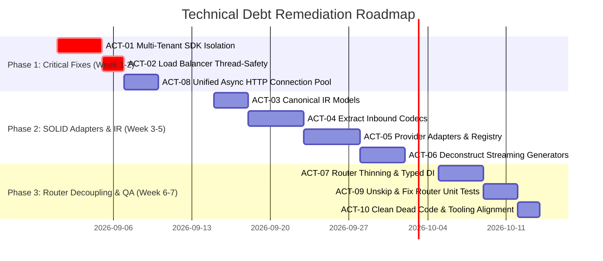

# Technical Debt Assessment: SAP AI Core LLM Proxy Server

**Assessment Date**: August 2026  
**Target Repository**: `sap-ai-core-llm-proxy`  
**Architecture Type**: Modular Proxy Server (FastAPI / Uvicorn + SAP AI Core SDK)  

---

## Executive Summary

The **SAP AI Core LLM Proxy** acts as a critical intermediary translating diverse LLM client protocols (OpenAI Chat Completions, Anthropic Messages API, Google Gemini) into SAP AI Core backend deployment requests with multi-subaccount load balancing.

While recent refactoring efforts successfully migrated the server from a 2,500-line monolithic Flask app to FastAPI routers (`routers/`), substantial technical debt remains across **7 key dimensions**. Notably, critical issues exist in **multi-tenant SDK caching**, **combinatorial converter complexity**, **unlocked concurrency state**, **asymmetric resilience patterns**, and **test suite bypasses**.

```
+-----------------------------------------------------------------------------------+
|                           TECHNICAL DEBT SEVERITY MATRIX                          |
+------------------------------------+----------------+--------------+--------------+
| Category                           | Critical (P0)  | High (P1)    | Medium (P2)  |
+------------------------------------+----------------+--------------+--------------+
| 1. Multi-Tenancy & Concurrency     |       1        |      1       |      1       |
| 2. Architecture & Modularity       |                |      2       |      2       |
| 3. Protocol & Format Conversion    |                |      2       |      1       |
| 4. Reliability & Error Handling    |                |      2       |      1       |
| 5. Observability & Telemetry       |                |      1       |      2       |
| 6. Testing & Quality Assurance     |                |      1       |      1       |
| 7. Build, Packaging & Tooling      |                |      1       |      2       |
+------------------------------------+----------------+--------------+--------------+
```

---

## 1. Multi-Tenancy, Caching & Concurrency Debt (Highest Risk)

### 1.1. Single-Tenant Collision in Bedrock SDK Pool (`utils/sdk_pool.py`)
* **Severity**: `CRITICAL (P0)`
* **Location**: [`utils/sdk_pool.py`](../utils/sdk_pool.py) (lines 182–274)
* **Root Cause**:
  1. `__proxy_client` is a single process-wide global singleton (`BaseProxyClient`). When multiple SAP AI Core subaccounts are configured, the first subaccount request initializes `__proxy_client`. Subsequent requests for *other* subaccounts reuse this first client, leaking credentials and routing requests through the wrong SAP tenant.
  2. `__model_client_map` is keyed exclusively by `model_name` (e.g., `anthropic--claude-4.6-sonnet`). When the round-robin load balancer attempts to balance traffic for the same model across subaccount A and subaccount B, it retrieves subaccount A's cached client and bypasses subaccount B completely.
* **Impact**: Silent cross-tenant credential contamination, broken multi-subaccount load balancing, security boundary violations.
* **Remediation**: Key the SDK client cache by a compound tuple `(subaccount_name, deployment_id, model_name)` and store `proxy_client` instances per subaccount (similar to the composite key pattern in [`utils/sdk_utils.py:_make_cache_key`](../utils/sdk_utils.py)).

### 1.2. Race Conditions in Load Balancer Counters (`load_balancer.py`)
* **Severity**: `HIGH (P1)`
* **Location**: [`load_balancer.py`](../load_balancer.py) (lines 19–226)
* **Root Cause**:
  `_load_balance_counters` is a plain global Python dictionary mutated directly during request execution (`_load_balance_counters[key] += 1`) without thread synchronization (`threading.Lock`) or atomic counters.
* **Impact**: Under concurrent traffic in multi-threaded Uvicorn execution, race conditions cause skipped counter increments, skewed load distribution, and potential `KeyError` exceptions.
* **Remediation**: Encapsulate load balancing state within a thread-safe `LoadBalancer` class protected by `threading.Lock` or `itertools.cycle` / atomic primitives.

### 1.3. Dual Independent Locks in Token Management (`config/config_models.py` vs `auth/token_manager.py`)
* **Severity**: `MEDIUM (P2)`
* **Location**: [`config/config_models.py`](../config/config_models.py) (line 55) and [`auth/token_manager.py`](../auth/token_manager.py) (line 47)
* **Root Cause**:
  `TokenInfo` dataclass defines its own `lock: threading.Lock = field(default_factory=threading.Lock)`, while `TokenManager` instantiates an independent `self._lock = threading.Lock()`. If multiple `TokenManager` instances are instantiated for the same subaccount (e.g. across `ProxyGlobalContext` lazy reloads), their locks do not synchronize access to the underlying `token_info`.
* **Remediation**: Bind locking directly to the `SubAccountConfig.token_info` state or maintain strict singleton `TokenManager` lifecycles.

---

## 2. Architecture & Modularity Debt

### 2.1. God Module in Protocol Conversion (`proxy_helpers.py`)
* **Severity**: `HIGH (P1)`
* **Location**: [`proxy_helpers.py`](../proxy_helpers.py) (1,711 lines)
* **Root Cause**:
  `class Converters` contains 15+ ad-hoc translation methods doing direct conversions between pairs of formats (`convert_openai_to_claude`, `convert_openai_to_claude37`, `convert_claude_request_to_gemini`, `convert_gemini_response_to_claude`, etc.).
* **Impact**:
  - $O(N \times M)$ combinatorial explosion when introducing new LLM providers.
  - Fragile schema mutations where internal format drift in one helper breaks unrelated routes.
  - High cognitive overhead and difficulty in unit testing individual conversion blocks.
* **Remediation**: Adopt an Intermediate Representation (Unified Canonical AST / Message Model) or separate provider-specific codec classes (`adapters/openai.py`, `adapters/anthropic.py`, `adapters/gemini.py`).

### 2.2. Monolithic 750-Line Streaming Generator (`handlers/streaming_generators.py`)
* **Severity**: `HIGH (P1)`
* **Location**: [`handlers/streaming_generators.py`](../handlers/streaming_generators.py) (lines 187–944)
* **Root Cause**:
  A single async generator function `generate_streaming_response` contains hundreds of lines of branching logic for Claude 3.7 vs Claude 3.5 vs Gemini vs OpenAI streaming, manual SSE line decoding, buffer accumulation, token extraction, and error framing.
* **Impact**: Extreme cyclomatic complexity, unmaintainable control flow, difficult testability, and high probability of regression when updating streaming format logic.
* **Remediation**: Split into discrete streaming transformers using the Strategy pattern (`ClaudeStreamTransformer`, `GeminiStreamTransformer`, `DefaultStreamTransformer`).

### 2.3. Hybrid Sync/Async I/O Architecture
* **Severity**: `MEDIUM (P2)`
* **Location**: [`routers/chat.py`](../routers/chat.py), [`handlers/streaming_handler.py`](../handlers/streaming_handler.py), [`auth/token_manager.py`](../auth/token_manager.py)
* **Root Cause**:
  The application is built on FastAPI (async), but non-streaming requests and token fetches use blocking synchronous `requests.post()` wrapped in `run_in_threadpool`, while streaming endpoints use `httpx.AsyncClient`.
* **Impact**: Thread pool exhaustion under high concurrent load, double HTTP client dependencies (`requests` + `httpx`), and duplicated connection pooling logic.
* **Remediation**: Standardize entirely on `httpx.AsyncClient` with a shared connection pool across all services and auth managers.

### 2.4. Dead & Orphaned Code
* **Severity**: `LOW-MEDIUM (P2)`
* **Locations**:
  - [`utils/api_logging.py`](../utils/api_logging.py) (100 lines): Completely unreferenced anywhere in the codebase.
  - [`utils/error_handlers.py`](../utils/error_handlers.py) (`handle_http_429_error`): Never imported by active routers; only exists in legacy tests.
  - [`test_mmyydd_logging.py`](../test_mmyydd_logging.py) & [`test_yyyymmdd_logging.py`](../test_yyyymmdd_logging.py): Stray debugging scripts located in the root repository.
  - [`proxy_server.py`](../proxy_server.py) (lines 39–68): `handle_embedding_service_call` and `format_embedding_response` linger in `proxy_server.py` despite being reimplemented (or bypassed) in `routers/embeddings.py`.
* **Remediation**: Remove orphaned files and clean up legacy re-exports.

---

## 3. Protocol & Provider Translation Fragility Debt

### 3.1. Dangerous and Fragile Parsers (`ast.literal_eval`)
* **Severity**: `HIGH (P1)`
* **Location**: [`handlers/streaming_generators.py`](../handlers/streaming_generators.py) (line 289) and [`handlers/streaming_handler.py`](../handlers/streaming_handler.py) (line 112)
* **Code**:
  ```python
  try:
      claude_dict_chunk = json.loads(line_content)
  except json.JSONDecodeError:
      claude_dict_chunk = ast.literal_eval(line_content)
  ```
* **Impact**: Falling back to `ast.literal_eval` on arbitrary stream data is brittle, masks upstream format corruption, and poses potential security/DOS risks on malformed payloads.
* **Remediation**: Fix the root cause of non-standard JSON formatting at the transport level and enforce strict JSON parsing with clear error logging.

### 3.2. Heuristic and Loose Model Detection (`proxy_helpers.py:Detector`)
* **Severity**: `MEDIUM (P1)`
* **Location**: [`proxy_helpers.py`](../proxy_helpers.py) (lines 37–101)
* **Root Cause**:
  - `Detector.is_claude_model` matches partial substrings like `"clau"`, `"sonn"`, `"claud"`.
  - `Detector.is_claude_family` has a misleading name: it actually determines whether a Claude model uses the AWS Bedrock `/converse` API (Claude 3.7/4.x) vs `/invoke` API (Claude 3.5), returning `False` for `claude-3-5-sonnet`.
* **Impact**: Unexpected model classification for custom model aliases or third-party fine-tunes containing substrings like `"clause"`, `"personnel"`, etc.
* **Remediation**: Use strict regex / prefix matching and rename methods to accurately reflect their semantic purpose (e.g. `uses_bedrock_converse_api()`).

### 3.3. Hardcoded Speculative Fallback Models (`load_balancer.py`)
* **Severity**: `MEDIUM (P2)`
* **Location**: [`load_balancer.py`](../load_balancer.py) (lines 47–80 & 115–188)
* **Root Cause**:
  Hardcoded fallback model chains (`"anthropic--claude-4.7-opus"`, `"anthropic--claude-4.6-sonnet"`, `"gemini-2.5-pro"`, `"gpt-4.1"`) are duplicated across two separate functions in `load_balancer.py`.
* **Remediation**: Consolidate model fallback rules into a configurable schema in `config.json` rather than hardcoding static lists in source code.

---

## 4. Reliability, Resilience & Error Handling Debt

### 4.1. Asymmetric Resilience Architecture
* **Severity**: `HIGH (P1)`
* **Location**: [`utils/circuit_breaker.py`](../utils/circuit_breaker.py) vs [`routers/chat.py`](../routers/chat.py) & [`routers/embeddings.py`](../routers/embeddings.py)
* **Root Cause**:
  The circuit breaker implementation is solely integrated into certificate recovery inside `routers/messages.py`. There is no circuit breaker protection for backend API outages (500/503/504), network timeouts, or rate limit cascading in `routers/chat.py`, `routers/embeddings.py`, or general Bedrock calls.
* **Impact**: Under upstream SAP AI Core degradation or network flap, requests will block worker threads until timeouts elapse, causing cascading gateway timeouts.
* **Remediation**: Wrap all external backend calls in a centralized resilience layer combining retries (`tenacity`) with per-endpoint / per-subaccount circuit breakers.

### 4.2. Invalid SSE Protocol Formatting on Stream Errors
* **Severity**: `HIGH (P1)`
* **Location**: [`handlers/streaming_generators.py`](../handlers/streaming_generators.py) (line 375)
* **Code**:
  ```python
  # Missing 'data: ' prefix required by SSE specification
  yield f"{json.dumps(error_payload)}\n\n"
  ```
* **Impact**: Standard SSE client parsers (e.g. OpenAI SDK, browser EventSource) fail to parse or silently drop error frames missing the `data: ` prefix.
* **Remediation**: Ensure all SSE chunks pass through `_format_sse_event("data", payload)` or `f"data: {json.dumps(error_payload)}\n\n"`.

### 4.3. Connection Pool Churn in Async Streaming
* **Severity**: `MEDIUM (P2)`
* **Location**: [`handlers/streaming_generators.py`](../handlers/streaming_generators.py) (line 262)
* **Root Cause**:
  `async with httpx.AsyncClient(timeout=timeout_config) as client:` is executed inside every streaming request, instantiating a new TCP connection and SSL handshake per request rather than reusing connection pools.
* **Impact**: Significant latency overhead and socket exhaustion under high request volume.
* **Remediation**: Maintain a long-lived `httpx.AsyncClient` attached to `app.state` or `ProxyGlobalContext`.

---

## 5. Observability & Telemetry Debt

### 5.1. Broken & Dormant Metrics (`utils/metrics.py` & `utils/metrics_middleware.py`)
* **Severity**: `MEDIUM (P1)`
* **Location**: [`utils/metrics.py`](../utils/metrics.py) (line 27) & [`routers/status.py`](../routers/status.py) (lines 28–56)
* **Root Cause**:
  `MetricsCollector.increment_model_request()` is never invoked anywhere in the codebase. As a result, the `/stats` endpoint always returns `"requests_by_model": {}`.
* **Remediation**: Call `increment_model_request` in the router layer once the model is resolved.

### 5.2. Double Config Loading & Duplicate Auto-Discovery on Startup
* **Severity**: `MEDIUM (P2)`
* **Location**: [`main.py`](../main.py) (lines 22 and 137)
* **Root Cause**:
  `load_proxy_config(config_path)` is executed once in `main()` and a second time in `lifespan(app)`. Because `load_proxy_config` executes deployment auto-discovery, the proxy performs duplicate remote HTTPS calls to SAP AI Core during boot.
* **Remediation**: Pass the loaded `ProxyConfig` directly into `create_app` or execute config loading exclusively within the `lifespan` handler.

### 5.3. Hardcoded Debug Logging in Lifespan
* **Severity**: `LOW (P2)`
* **Location**: [`main.py`](../main.py) (line 23)
* **Root Cause**:
  `init_logging(debug=True)` is hardcoded inside the FastAPI `lifespan` generator, overriding the CLI `--debug` argument and forcing debug logging in production.
* **Remediation**: Store the CLI `debug` flag in `app.state` and pass it to `init_logging`.

---

## 6. Testing & Quality Assurance Debt

### 6.1. Skipped Test Suites in Active Routers
* **Severity**: `HIGH (P1)`
* **Location**: [`tests/unit/routers/test_chat_router.py`](../tests/unit/routers/test_chat_router.py) (12 skipped tests across multiple classes) and [`tests/unit/routers/test_embeddings_router.py`](../tests/unit/routers/test_embeddings_router.py)
* **Reason given in code**: `@pytest.mark.skip(reason="Tests require complex mocking of internal implementation")`
* **Impact**: Core chat completion request handling, error propagation, and thread pool execution paths in the FastAPI routers are completely unverified by CI.
* **Remediation**: Decouple router dependencies via FastAPI `Depends()` injection to simplify test fixture mocking and enable all skipped tests.

### 6.2. Fragmented & Legacy Test Architecture
* **Severity**: `MEDIUM (P2)`
* **Locations**:
  - `tests/test_proxy_server.py` (1,983 lines) & `tests/test_proxy_helpers.py` (1,409 lines) contain massive legacy monolithic test suites with backward-compatibility mocks for Flask.
  - Inconsistent directory structure: `tests/unit/routers/` vs `tests/unit/test_handlers/` vs `tests/unit/test_auth/`.
  - `tests/unit/test_messages_blueprint.py` still carries the legacy Flask "blueprint" naming convention.
* **Remediation**: Reorganize test files into a standard structure mirroring `src/` (`tests/unit/routers/`, `tests/unit/handlers/`, etc.) and break down 1,000+ line test files.

---

## 7. Build, Packaging & Tooling Debt

### 7.1. PyInstaller Build Script Misalignment (`Makefile`)
* **Severity**: `HIGH (P1)`
* **Location**: [`Makefile`](../Makefile) (line 4: `MAIN_SCRIPT := ./proxy_server.py`)
* **Root Cause**:
  The `Makefile` build target builds PyInstaller binaries from the deprecated script `proxy_server.py` (which emits deprecation warnings) rather than the primary FastAPI entrypoint `main.py`.
* **Remediation**: Update `Makefile` to target `main.py`.

### 7.2. Strict Python Minor Version Pinning (`pyproject.toml`)
* **Severity**: `MEDIUM (P2)`
* **Location**: [`pyproject.toml`](../pyproject.toml) (line 6)
* **Root Cause**:
  `requires-python = "==3.13.*"` restricts usage exclusively to Python 3.13, preventing deployment on Python 3.11, 3.12, or 3.14 environments.
* **Remediation**: Broaden python constraint to `requires-python = ">=3.11,<3.14"`.

### 7.3. Incomplete Code Coverage Scope (`Makefile`)
* **Severity**: `LOW (P2)`
* **Location**: [`Makefile`](../Makefile) (line 119)
* **Root Cause**:
  `test-cov` only measures coverage for `--cov=proxy_server --cov=proxy_helpers`, omitting `routers/`, `handlers/`, `auth/`, `config/`, and `utils/`.
* **Remediation**: Configure `pytest.ini` / `pyproject.toml` with global coverage measuring all source packages.

---

---

## 8. SOLID Principles Action Plan & Complexity Reduction

To eliminate structural technical debt and dramatically reduce cognitive and cyclomatic complexity, the proxy architecture will undergo a 4-pillar SOLID refactoring.

```
+---------------------------------------------------------------------------------------------------+
|                                SOLID TRANSFORMATION ACTION MATRIX                                 |
+---------+----------------------------------------------+----------+----------------+--------------+
| Item ID | Refactoring Action Item                      | SOLID    | Target File(s) | Complexity Δ |
+---------+----------------------------------------------+----------+----------------+--------------+
| ACT-01  | Multi-Tenant SDK Client Isolation            | SRP, DIP | utils/sdk_pool | High -> Low  |
| ACT-02  | Thread-Safe LoadBalancer Encapsulation       | SRP      | load_balancer  | Med -> Low   |
| ACT-03  | Canonical Intermediate Representation (IR)   | OCP, ISP | core/models/   | O(N*M)->O(N) |
| ACT-04  | Inbound Client Codecs Extraction             | SRP, ISP | adapters/codec | -1,711 lines |
| ACT-05  | Outbound Provider Adapters & Registry        | OCP, LSP | adapters/prov/ | OCP Enabler  |
| ACT-06  | Streaming Strategy Pattern Deconstruction    | SRP, LSP | adapters/strm/ | CC 48 -> 5   |
| ACT-07  | Router Thinning & Typed FastAPI DI           | SRP, DIP | routers/       | 200 -> 30 loc|
| ACT-08  | Unified Async HTTP Connection Pool           | DIP      | core/http/     | Sync reqs rm |
| ACT-09  | Unskip & Decouple Router Unit Tests          | DIP      | tests/unit/    | 12 unskipped |
| ACT-10  | Tooling & Dead Code Elimination              | -        | root / utils/  | Clean repo   |
+---------+----------------------------------------------+----------+----------------+--------------+
```

### Pillar 1: Inbound / Outbound Decoupling via Canonical IR (OCP & ISP)
* **`ACT-03` Define Canonical Intermediate Representation (`core/models/canonical.py`)**:
  - Replace pairwise conversions with a unified message format (`CanonicalChatRequest`, `CanonicalChatResponse`, `CanonicalStreamChunk`).
  - **Complexity Impact**: Reduces conversion pathways from $O(N \times M)$ to $O(N + M)$.
* **`ACT-04` Extract Inbound Codecs (`adapters/codecs/`)**:
  - Decompose [`proxy_helpers.py:Converters`](../proxy_helpers.py) into dedicated, isolated codec classes: `OpenAICodec`, `AnthropicCodec`, `GeminiCodec`.
  - **Complexity Impact**: Eliminates the 1,711-line God module.

### Pillar 2: Provider Extensibility & Streaming Strategies (SRP, LSP & OCP)
* **`ACT-05` Implement `BaseLLMAdapter` Protocol & Registry (`adapters/providers/`)**:
  - Implement uniform provider adapters (`BedrockConverseAdapter`, `BedrockInvokeAdapter`, `GeminiAPIAdapter`, `AzureOpenAIAdapter`).
  - Introduce `@AdapterRegistry.register` for zero-touch provider addition without modifying core routing logic.
  - **Complexity Impact**: Adding a future provider (e.g. DeepSeek, Mistral) requires creating **1 new file** instead of modifying 6 files.
* **`ACT-06` Deconstruct Monolithic Streaming Generator (`adapters/transformers/`)**:
  - Break down [`handlers/streaming_generators.py`](../handlers/streaming_generators.py) (750+ lines) into modular Stream Transformers (`ClaudeStreamTransformer`, `GeminiStreamTransformer`, `DefaultStreamTransformer`) adhering to a shared `StreamTransformer` interface.
  - Fix missing `data: ` prefix on error chunks and replace `ast.literal_eval` with strict transport decoders.
  - **Complexity Impact**: Cyclomatic complexity reduced from 48 to < 5 per transformer.

### Pillar 3: Clean Router Orchestration & Dependency Inversion (SRP & DIP)
* **`ACT-07` Thin Routers & Introduce `ProxyOrchestrator` (`routers/` & `core/orchestrator.py`)**:
  - Extract load balancing, token retrieval, resilience, and adapter dispatch from route handlers into `ProxyOrchestrator`.
  - Inject dependencies into routes via typed FastAPI `Depends()` rather than untyped `request.app.state`.
  - **Complexity Impact**: Reduces router file sizes from ~200 lines to ~30 lines of pure HTTP declaration.
* **`ACT-09` Unskip & Decouple Router Unit Tests (`tests/unit/routers/`)**:
  - Remove `@pytest.mark.skip` from [`tests/unit/routers/test_chat_router.py`](../tests/unit/routers/test_chat_router.py) and [`test_embeddings_router.py`](../tests/unit/routers/test_embeddings_router.py) by passing mock dependencies directly into FastAPI `dependency_overrides`.

### Pillar 4: Concurrency, Multi-Tenancy & Async I/O (SRP & DIP)
* **`ACT-01` Fix Multi-Tenant Client Pool (`utils/sdk_pool.py`)**:
  - Key client caches by `(subaccount_name, deployment_id, model_name)` and store `proxy_client` per subaccount to prevent cross-account credential leakage.
* **`ACT-02` Encapsulate Load Balancer (`load_balancer.py`)**:
  - Wrap `_load_balance_counters` inside a thread-safe class using `threading.Lock` and configurable fallback maps.
* **`ACT-08` Unified Async HTTP Client (`core/http/client.py`)**:
  - Replace blocking `requests.post()` in [`auth/token_manager.py`](../auth/token_manager.py) and [`handlers/streaming_handler.py`](../handlers/streaming_handler.py) with a shared, persistent `httpx.AsyncClient` connection pool.

---

## Technical Debt Remediation Roadmap



### Action Items Ranked by Priority & ROI

1. **`ACT-01` Fix Multi-Tenant SDK Client Pool (`utils/sdk_pool.py`)**: Key cache by `(subaccount, deployment_id, model)` to prevent cross-account credential leakage and broken load balancing.
2. **`ACT-02` Thread-Safe Load Balancer (`load_balancer.py`)**: Add locking around `_load_balance_counters`.
3. **`ACT-03` & `ACT-04` Canonical IR & Inbound Codecs**: Replace 1,711-line `proxy_helpers.py` with Canonical IR and decoupled codecs ($O(N \times M) \to O(N+M)$).
4. **`ACT-05` & `ACT-06` Outbound Adapters & Streaming Transformers**: Split monolithic 750-line streaming generator into provider stream transformers.
5. **`ACT-07` & `ACT-09` Router Thinning & Unskipping Unit Tests**: Decouple FastAPI routers, use `Depends()`, and re-enable skipped router tests.
6. **`ACT-08` Unified Async I/O**: Eliminate blocking `requests.post()` in thread pools in favor of a shared `httpx.AsyncClient` pool.
7. **`ACT-10` Tooling & Dead Code Elimination**: Update `Makefile` target to `main.py`, remove dead scripts (`test_mmyydd_logging.py`, `utils/api_logging.py`), and expand Python version compatibility in `pyproject.toml`.

