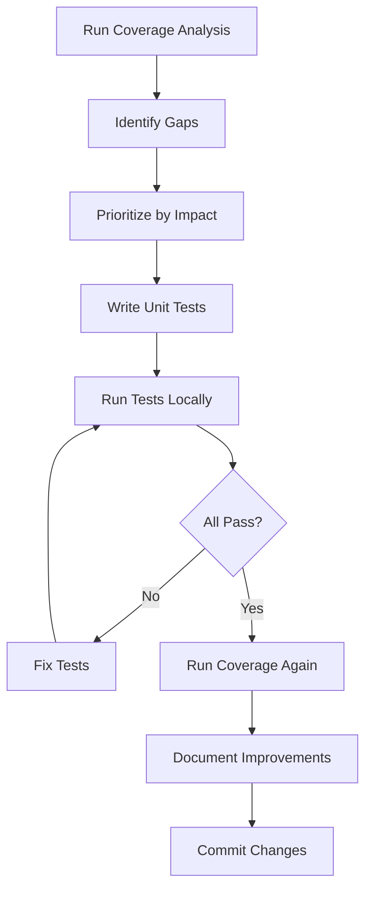

# Test Coverage Improvement Plan

## Executive Summary

This document outlines a comprehensive plan to improve test coverage for the SAP AI Core LLM Proxy project. The project has been refactored into modular components (`auth/`, `config/`, `utils/`), and while some modules have unit tests, others lack coverage entirely.

## Implementation Status

**Last Updated:** 2025-12-15

### ✅ Completed

- **SDK Session Management Tests** - [`tests/unit/test_sdk_session_management.py`](../tests/unit/test_sdk_session_management.py)
  - 15 comprehensive test cases implemented
  - 100% coverage of [`get_sapaicore_sdk_session()`](../proxy_server.py:41) and [`get_sapaicore_sdk_client()`](../proxy_server.py:52)
  - All tests passing
  - Thread-safety verified with concurrent tests
  - Performance caching validated

## Current Test Structure

### Existing Test Files

```
tests/
├── __init__.py
├── README.md
├── test_proxy_server.py          # Main proxy server tests (1744 lines)
├── test_proxy_server_extended.py # Extended tests (1477 lines)
├── test_proxy_helpers.py         # Helper function tests (1479 lines)
└── unit/
    └── test_auth/
        ├── test_request_validator.py  # RequestValidator tests (122 lines)
        └── test_token_manager.py      # TokenManager tests (167 lines)
```

### Test Coverage by Module

#### ✅ Well-Covered Modules

- **[`proxy_helpers.py`](proxy_helpers.py)** - Comprehensive tests in [`test_proxy_helpers.py`](tests/test_proxy_helpers.py)
  - [`Detector`](proxy_helpers.py:7) class (model detection)
  - [`Converters`](proxy_helpers.py:41) class (payload conversions)
  - Edge cases and error handling

- **[`auth/request_validator.py`](auth/request_validator.py)** - Unit tests in [`test_request_validator.py`](tests/unit/test_auth/test_request_validator.py)
  - [`RequestValidator`](auth/request_validator.py:12) class
  - Token validation logic
  - Backward compatibility functions

- **[`auth/token_manager.py`](auth/token_manager.py)** - Unit tests in [`test_token_manager.py`](tests/unit/test_auth/test_token_manager.py)
  - [`TokenManager`](auth/token_manager.py:22) class
  - Token caching and expiry
  - Thread-safety

- **[`proxy_server.py`](proxy_server.py)** - Extensive tests in [`test_proxy_server.py`](tests/test_proxy_server.py) and [`test_proxy_server_extended.py`](tests/test_proxy_server_extended.py)
  - Flask endpoints
  - Request handlers
  - Load balancing
  - Streaming responses

#### ❌ Missing or Incomplete Coverage

1. **[`config/loader.py`](config/loader.py)** - **NO TESTS**
   - [`load_config()`](config/loader.py:12) function
   - JSON parsing and validation
   - Multi-subaccount configuration loading
   - Backward compatibility handling

2. **[`config/models.py`](config/models.py)** - **PARTIAL COVERAGE**
   - Basic dataclass tests exist in [`test_proxy_server.py`](tests/test_proxy_server.py)
   - Missing: [`SubAccountConfig.load_service_key()`](config/models.py:40)
   - Missing: [`SubAccountConfig.normalize_model_names()`](config/models.py:55)
   - Missing: [`ProxyConfig.initialize()`](config/models.py:82)
   - Missing: [`ProxyConfig.build_model_mapping()`](config/models.py:91)

3. **[`utils/logging_setup.py`](utils/logging_setup.py)** - **NO TESTS**
   - [`setup_logging()`](utils/logging_setup.py:11) function
   - [`get_token_logger()`](utils/logging_setup.py:27) function
   - Log file creation and formatting

4. **[`utils/error_handlers.py`](utils/error_handlers.py)** - **PARTIAL COVERAGE**
   - [`handle_http_429_error()`](utils/error_handlers.py:12) tested in main tests
   - Missing: Dedicated unit tests for edge cases
   - Missing: Header mapping validation

5. **[`proxy_server.py`](proxy_server.py)** - **GAPS IN COVERAGE**
   - Missing: [`get_sapaicore_sdk_session()`](proxy_server.py:41) caching behavior
   - Missing: [`get_sapaicore_sdk_client()`](proxy_server.py:52) client reuse
   - Missing: Complex streaming scenarios
   - Missing: Multi-subaccount failover scenarios

## Coverage Improvement Plan

### Phase 1: Establish Baseline (Priority: HIGH)

**Objective:** Measure current coverage to identify specific gaps

**Tasks:**

1. Run coverage analysis: `make test-cov`
2. Generate detailed coverage report
3. Identify functions/lines with 0% coverage
4. Document baseline metrics in this file

**Expected Output:**

```bash
# Coverage report format
Name                           Stmts   Miss  Cover   Missing
----------------------------------------------------------
proxy_server.py                 500    50    90%     45-50, 120-125
proxy_helpers.py                400    20    95%     
auth/request_validator.py        50     5    90%     
auth/token_manager.py            60     8    87%     
config/loader.py                 30    30     0%     ← CRITICAL
config/models.py                 60    25    58%     ← NEEDS WORK
utils/logging_setup.py           25    25     0%     ← CRITICAL
utils/error_handlers.py          35    10    71%     
----------------------------------------------------------
TOTAL                          1160   173    85%
```

### Phase 2: Unit Tests for Config Module (Priority: HIGH)

**File:** `tests/unit/test_config/test_loader.py`

**Test Cases:**

```python
class TestLoadConfig:
    """Test configuration loading from JSON files."""
    
    def test_load_config_new_format_with_subaccounts(self):
        """Test loading new format with subAccounts."""
        
    def test_load_config_legacy_format_backward_compatibility(self):
        """Test loading legacy single-account format."""
        
    def test_load_config_file_not_found(self):
        """Test FileNotFoundError when config missing."""
        
    def test_load_config_invalid_json(self):
        """Test JSONDecodeError for malformed JSON."""
        
    def test_load_config_missing_required_fields(self):
        """Test handling of missing required fields."""
        
    def test_load_config_multiple_subaccounts(self):
        """Test loading config with multiple subaccounts."""
        
    def test_load_config_empty_subaccounts(self):
        """Test handling of empty subAccounts dict."""
        
    def test_load_config_default_values(self):
        """Test default port and host values."""
```

**File:** `tests/unit/test_config/test_models.py`

**Test Cases:**

```python
class TestSubAccountConfig:
    """Test SubAccountConfig dataclass methods."""
    
    def test_load_service_key_success(self):
        """Test successful service key loading."""
        
    def test_load_service_key_file_not_found(self):
        """Test error handling when key file missing."""
        
    def test_load_service_key_invalid_json(self):
        """Test error handling for invalid key JSON."""
        
    def test_normalize_model_names_disabled(self):
        """Test model name normalization (currently disabled)."""
        
    def test_normalize_model_names_preserves_originals(self):
        """Test that original model names are preserved."""

class TestProxyConfig:
    """Test ProxyConfig initialization and methods."""
    
    def test_initialize_single_subaccount(self):
        """Test initialization with one subaccount."""
        
    def test_initialize_multiple_subaccounts(self):
        """Test initialization with multiple subaccounts."""
        
    def test_build_model_mapping_single_model(self):
        """Test model mapping with one model."""
        
    def test_build_model_mapping_shared_models(self):
        """Test model mapping when multiple subaccounts have same model."""
        
    def test_build_model_mapping_unique_models(self):
        """Test model mapping with unique models per subaccount."""
        
    def test_build_model_mapping_empty_deployments(self):
        """Test handling of subaccounts with no models."""
```

**Estimated Coverage Improvement:** config/loader.py: 0% → 95%, config/models.py: 58% → 90%

### Phase 3: Unit Tests for Utils Module (Priority: HIGH)

**File:** `tests/unit/test_utils/test_logging_setup.py`

**Test Cases:**

```python
class TestSetupLogging:
    """Test logging configuration."""
    
    def test_setup_logging_info_level(self):
        """Test default INFO level logging."""
        
    def test_setup_logging_debug_level(self):
        """Test DEBUG level when debug=True."""
        
    def test_setup_logging_format(self):
        """Test log message format."""

class TestGetTokenLogger:
    """Test token usage logger."""
    
    def test_get_token_logger_creates_logger(self):
        """Test logger creation."""
        
    def test_get_token_logger_creates_log_directory(self):
        """Test automatic log directory creation."""
        
    def test_get_token_logger_creates_log_file(self):
        """Test log file creation."""
        
    def test_get_token_logger_singleton_behavior(self):
        """Test that logger is reused, not recreated."""
        
    def test_get_token_logger_file_handler_format(self):
        """Test log file format."""
```

**File:** `tests/unit/test_utils/test_error_handlers.py`

**Test Cases:**

```python
class TestHandleHttp429Error:
    """Test HTTP 429 error handling."""
    
    def test_handle_http_429_basic(self):
        """Test basic 429 error handling."""
        
    def test_handle_http_429_with_retry_after_header(self):
        """Test Retry-After header mapping."""
        
    def test_handle_http_429_with_x_retry_after_header(self):
        """Test x-retry-after header mapping."""
        
    def test_handle_http_429_logs_all_headers(self):
        """Test that all response headers are logged."""
        
    def test_handle_http_429_logs_response_body(self):
        """Test response body logging."""
        
    def test_handle_http_429_handles_missing_body(self):
        """Test handling when response body unavailable."""
        
    def test_handle_http_429_custom_context(self):
        """Test custom context in error messages."""
        
    def test_handle_http_429_response_structure(self):
        """Test returned Flask response structure."""
```

**Estimated Coverage Improvement:** utils/logging_setup.py: 0% → 90%, utils/error_handlers.py: 71% → 95%

### Phase 4: Enhanced Integration Tests (Priority: MEDIUM)

**File:** `tests/integration/test_multi_subaccount.py`

**Test Cases:**

```python
class TestMultiSubaccountLoadBalancing:
    """Test load balancing across multiple subaccounts."""
    
    def test_round_robin_distribution(self):
        """Test requests are distributed round-robin."""
        
    def test_failover_to_next_subaccount(self):
        """Test failover when one subaccount fails."""
        
    def test_model_availability_across_subaccounts(self):
        """Test model routing to correct subaccounts."""
        
    def test_concurrent_requests_thread_safety(self):
        """Test thread-safe token management."""
        
    def test_token_refresh_during_load(self):
        """Test token refresh under load."""

class TestSDKSessionCaching:
    """Test SDK session and client caching."""
    
    def test_session_reuse(self):
        """Test that SDK sessions are reused."""
        
    def test_client_caching_per_model(self):
        """Test client caching by model name."""
        
    def test_thread_safe_session_access(self):
        """Test concurrent session access."""
        
    def test_session_initialization_once(self):
        """Test session initialized only once."""
```

**File:** `tests/integration/test_streaming_scenarios.py`

**Test Cases:**

```python
class TestStreamingEdgeCases:
    """Test complex streaming scenarios."""
    
    def test_streaming_with_connection_interruption(self):
        """Test handling of interrupted streams."""
        
    def test_streaming_with_malformed_chunks(self):
        """Test handling of malformed SSE chunks."""
        
    def test_streaming_buffer_overflow(self):
        """Test large streaming responses."""
        
    def test_streaming_timeout_handling(self):
        """Test timeout during streaming."""
        
    def test_streaming_error_mid_stream(self):
        """Test error handling mid-stream."""
```

**Estimated Coverage Improvement:** proxy_server.py: 90% → 95%

### Phase 5: End-to-End Integration Tests (Priority: LOW)

**File:** `tests/e2e/test_complete_workflows.py`

**Test Cases:**

```python
class TestCompleteWorkflows:
    """End-to-end tests for complete request/response cycles."""
    
    @pytest.mark.requires_credentials
    def test_openai_chat_completion_workflow(self):
        """Test complete OpenAI chat completion."""
        
    @pytest.mark.requires_credentials
    def test_claude_messages_workflow(self):
        """Test complete Claude Messages API workflow."""
        
    @pytest.mark.requires_credentials
    def test_embedding_workflow(self):
        """Test complete embedding request."""
        
    @pytest.mark.requires_credentials
    def test_streaming_workflow(self):
        """Test complete streaming response."""
```

**Note:** These tests require valid SAP AI Core credentials and should be marked with `@pytest.mark.requires_credentials` to skip in CI/CD.

## Implementation Strategy

### Test Development Workflow



### Test File Organization

```
tests/
├── __init__.py
├── README.md
├── conftest.py                    # Shared fixtures
├── test_proxy_server.py           # Existing
├── test_proxy_server_extended.py  # Existing
├── test_proxy_helpers.py          # Existing
├── unit/
│   ├── test_auth/
│   │   ├── test_request_validator.py  # Existing
│   │   └── test_token_manager.py      # Existing
│   ├── test_config/                   # NEW
│   │   ├── __init__.py
│   │   ├── test_loader.py
│   │   └── test_models.py
│   └── test_utils/                    # NEW
│       ├── __init__.py
│       ├── test_logging_setup.py
│       └── test_error_handlers.py
├── integration/                       # NEW
│   ├── __init__.py
│   ├── test_multi_subaccount.py
│   └── test_streaming_scenarios.py
└── e2e/                              # NEW
    ├── __init__.py
    └── test_complete_workflows.py
```

### Shared Fixtures (conftest.py)

Create common fixtures to reduce duplication:

```python
# tests/conftest.py
import pytest
from config import ProxyConfig, SubAccountConfig, ServiceKey

@pytest.fixture
def sample_service_key():
    """Provide sample service key for testing."""
    return ServiceKey(
        clientid="test-client-id",
        clientsecret="test-secret",
        url="https://test.auth.url",
        identityzoneid="test-zone"
    )

@pytest.fixture
def sample_subaccount_config(tmp_path):
    """Provide sample subaccount configuration."""
    # Create temporary service key file
    key_file = tmp_path / "service_key.json"
    key_file.write_text('{"clientid":"test","clientsecret":"secret",...}')
    
    return SubAccountConfig(
        name="test-subaccount",
        resource_group="default",
        service_key_json=str(key_file),
        deployment_models={"gpt-4": ["deployment-1"]}
    )

@pytest.fixture
def sample_proxy_config():
    """Provide sample proxy configuration."""
    return ProxyConfig(
        secret_authentication_tokens=["test-token"],
        port=3001,
        host="127.0.0.1"
    )
```

## Coverage Goals

### Target Coverage by Module

| Module | Current | Target | Priority |
|--------|---------|--------|----------|
| [`proxy_server.py`](proxy_server.py) | ~90% | 95% | Medium |
| [`proxy_helpers.py`](proxy_helpers.py) | ~95% | 98% | Low |
| [`auth/request_validator.py`](auth/request_validator.py) | ~90% | 95% | Low |
| [`auth/token_manager.py`](auth/token_manager.py) | ~87% | 95% | Medium |
| [`config/loader.py`](config/loader.py) | **0%** | **95%** | **HIGH** |
| [`config/models.py`](config/models.py) | **58%** | **90%** | **HIGH** |
| [`utils/logging_setup.py`](utils/logging_setup.py) | **0%** | **90%** | **HIGH** |
| [`utils/error_handlers.py`](utils/error_handlers.py) | 71% | 95% | High |

### Overall Project Goal

- **Current Estimated:** ~85%
- **Target:** 95%
- **Timeline:** 2-3 weeks

## Testing Best Practices

### 1. Test Isolation

- Each test should be independent
- Use fixtures for setup/teardown
- Mock external dependencies (HTTP, file I/O, SDK calls)

### 2. Test Naming Convention

```python
def test_<function_name>_<scenario>_<expected_result>():
    """Clear description of what is being tested."""
```

### 3. AAA Pattern

```python
def test_example():
    # Arrange - Set up test data
    input_data = {"key": "value"}
    
    # Act - Execute the function
    result = function_under_test(input_data)
    
    # Assert - Verify the result
    assert result == expected_output
```

### 4. Parametrized Tests

Use `@pytest.mark.parametrize` for testing multiple inputs:

```python
@pytest.mark.parametrize("input,expected", [
    ("claude-3-opus", True),
    ("gpt-4", False),
])
def test_is_claude_model(input, expected):
    assert Detector.is_claude_model(input) == expected
```

### 5. Mock External Dependencies

```python
@patch('config.loader.open', mock_open(read_data='{"key": "value"}'))
def test_load_config_with_mock():
    result = load_config("test.json")
    assert result is not None
```

## Continuous Integration

### Pre-commit Hooks

Add coverage check to pre-commit:

```yaml
# .pre-commit-config.yaml
- repo: local
  hooks:
    - id: pytest-coverage
      name: pytest-coverage
      entry: pytest --cov=. --cov-fail-under=90
      language: system
      pass_filenames: false
```

### CI/CD Pipeline

Ensure tests run on every PR:

```yaml
# .github/workflows/test.yml
name: Tests
on: [push, pull_request]
jobs:
  test:
    runs-on: ubuntu-latest
    steps:
      - uses: actions/checkout@v2
      - name: Run tests with coverage
        run: make test-cov
      - name: Upload coverage to Codecov
        uses: codecov/codecov-action@v2
```

## Documentation Updates

After implementing tests, update:

1. **[`tests/README.md`](tests/README.md)** - Add new test modules
2. **[`AGENTS.md`](AGENTS.md)** - Update test commands if needed
3. **[`README.md`](README.md)** - Add coverage badge
4. This document - Update baseline and achieved metrics

## Success Metrics

### Quantitative

- ✅ Overall coverage ≥ 95%
- ✅ All modules ≥ 90% coverage
- ✅ Zero critical gaps (0% coverage modules)
- ✅ All tests passing in CI/CD

### Qualitative

- ✅ Tests are maintainable and readable
- ✅ Tests catch real bugs (not just coverage)
- ✅ Fast test execution (< 30 seconds for unit tests)
- ✅ Clear test documentation

## Next Steps

1. **Run baseline coverage analysis** (see Phase 1)
2. **Review and approve this plan**
3. **Create test files in priority order**
4. **Implement tests incrementally**
5. **Monitor coverage improvements**
6. **Document lessons learned**

## References

- [Pytest Documentation](https://docs.pytest.org/)
- [Pytest-cov Documentation](https://pytest-cov.readthedocs.io/)
- [Python unittest.mock](https://docs.python.org/3/library/unittest.mock.html)
- [Test-Driven Development Best Practices](https://testdriven.io/blog/modern-tdd/)

---

**Document Version:** 1.0  
**Last Updated:** 2025-12-15  
**Author:** Kilo Code (Architect Mode)
