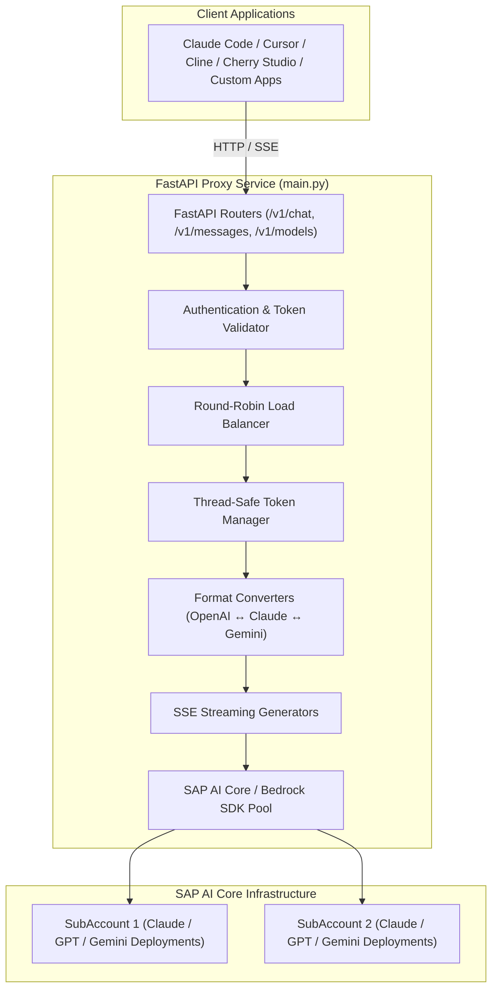

# Architecture Documentation

The **SAP AI Core LLM Proxy** transforms heterogeneous SAP AI Core APIs into standard OpenAI Chat Completions, Embeddings, and Anthropic Messages API protocols with multi-subaccount load balancing.

---

## 1. System Overview



---

## 2. Component Layout

```
├── main.py                    # Application entry point & FastAPI factory
├── routers/                   # Modular FastAPI routers
│   ├── chat.py                # /v1/chat/completions router
│   ├── messages.py            # /v1/messages (Anthropic Messages API) router
│   ├── models.py              # /v1/models router
│   ├── embeddings.py          # /v1/embeddings router
│   └── status.py              # /health, /info, /stats observability endpoints
├── handlers/                  # Streaming generators and model response handlers
├── auth/                      # OAuth token caching and request authentication
├── config/                    # Pydantic configuration models and parser
├── utils/                     # SDK pooling, logging setup, error handlers, retry logic
├── load_balancer.py           # Multi-subaccount round-robin distribution
└── proxy_helpers.py           # Format converters & model detection helpers
```

---

## 3. Protocol Translation Pipeline

### Chat Completions (`/v1/chat/completions`)
1. Client sends OpenAI format JSON.
2. Proxy detects target backend (`Detector.is_claude_37_or_4`, `Detector.is_gemini_model`, etc.).
3. Request converted to target vendor format (`convert_openai_to_claude37`, `convert_openai_to_gemini`).
4. Dispatched to SAP AI Core endpoint (`/converse`, `/converse-stream`, `/generateContent`, or `/chat/completions`).
5. Response or SSE chunk translated back to OpenAI response format.

### Messages API (`/v1/messages`)
1. Client sends Anthropic format payload (e.g. from Claude Code).
2. Proxy cleanses payload (extracts `system` messages into top-level prompt, strips unsupported fields like `metadata` and `output_config`).
3. Dispatched directly via SAP AI Core AWS Bedrock SDK client wrapper.
4. Returns Anthropic format message or SSE event stream with normalized token counts.

---

## 4. Multi-Tenant Token Management & Load Balancing

- **Token Manager (`auth/token_manager.py`)**: Caches OAuth tokens per SAP AI Core subaccount with a 5-minute safety buffer before expiration. Token refresh is protected with thread locks.
- **Load Balancer (`load_balancer.py`)**: Rotates traffic across configured subaccounts and deployment URLs using round-robin distribution with model fallback.
