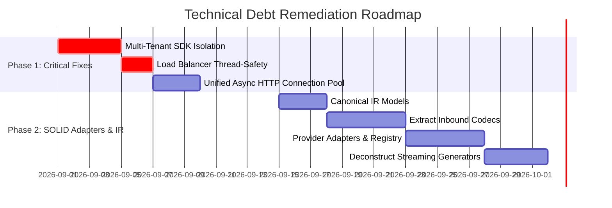

# Technical Debt Assessment & SOLID Refactoring Plan

**Target Repository**: `sap-ai-core-llm-proxy`  
**Architecture Type**: Modular Proxy Server (FastAPI / Uvicorn + SAP AI Core SDK)  

---

## 1. Executive Summary

The **SAP AI Core LLM Proxy** translates diverse LLM client protocols (OpenAI Chat Completions, Anthropic Messages API, Google Gemini) into SAP AI Core backend deployment requests with multi-subaccount load balancing.

While recent refactoring efforts successfully migrated the server from a 2,500-line monolithic Flask app to FastAPI routers (`routers/`), technical debt remains across key architectural dimensions:

```
+-----------------------------------------------------------------------------------+
|                           TECHNICAL DEBT SEVERITY MATRIX                          |
+------------------------------------+----------------+--------------+--------------+
| Category                           | Critical (P0)  | High (P1)    | Medium (P2)  |
+------------------------------------+----------------+--------------+--------------+
| 1. Multi-Tenancy & Concurrency     |       1        |      1       |      1       |
| 2. Architecture & Modularity       |                |      2       |      2       |
| 3. Protocol & Format Conversion    |                |      2       |      1       |
| 4. Reliability & Error Handling    |                |      2       |      1       |
| 5. Observability & Telemetry       |                |      1       |      2       |
+------------------------------------+----------------+--------------+--------------+
```

---

## 2. Multi-Tenancy, Caching & Concurrency Debt

### 2.1. Single-Tenant Collision in Bedrock SDK Pool (`utils/sdk_pool.py`) — `CRITICAL (P0)`
- `__proxy_client` and `__model_client_map` are process-wide singletons.
- When multiple SAP AI Core subaccounts are configured, the first subaccount client is reused for subsequent subaccounts, risking cross-tenant credential leakage.
- **Remediation**: Key the SDK client cache by a compound tuple `(subaccount_name, deployment_id, model_name)`.

### 2.2. Race Conditions in Load Balancer Counters (`load_balancer.py`) — `HIGH (P1)`
- `_load_balance_counters` dictionary mutated without thread synchronization.
- **Remediation**: Encapsulate load balancing state within a thread-safe `LoadBalancer` class protected by `threading.Lock`.

### 2.3. Dual Independent Locks in Token Management — `MEDIUM (P2)`
- `TokenInfo` and `TokenManager` maintain independent locks.
- **Remediation**: Synchronize locking directly on `SubAccountConfig.token_info`.

---

## 3. Architecture & Modularity Debt

### 3.1. Monolithic Protocol Conversion (`proxy_helpers.py`) — `HIGH (P1)`
- Direct pairwise conversions between format pairs cause combinatorial complexity ($O(N \times M)$).
- **Remediation**: Adopt Canonical Intermediate Representation (IR) and separate provider codecs.

### 3.2. Monolithic Streaming Generator (`handlers/streaming_generators.py`) — `HIGH (P1)`
- `generate_streaming_response` contains 750+ lines of branching logic.
- **Remediation**: Split into discrete streaming transformers using the Strategy pattern (`ClaudeStreamTransformer`, `GeminiStreamTransformer`, `DefaultStreamTransformer`).

### 3.3. Hybrid Sync/Async I/O — `MEDIUM (P2)`
- Synchronous `requests.post()` wrapped in threadpools mixed with `httpx.AsyncClient`.
- **Remediation**: Standardize entirely on a shared `httpx.AsyncClient` connection pool.

---

## 4. SOLID Converter Extraction Architecture

To deconstruct `proxy_helpers.py` into maintainable, single-responsibility modules:

```
converters/
├── __init__.py                # Central registry & get_converter() factory
├── base.py                    # Converter protocol / abstract base interfaces
├── openai_to_claude.py        # OpenAI → Claude 3.5 & 3.7 converters
├── claude_to_openai.py        # Claude → OpenAI response converters
├── openai_to_gemini.py        # OpenAI → Gemini payload converters
├── gemini_to_openai.py        # Gemini → OpenAI response converters
├── cross_model.py             # Cross-model conversions
└── streaming.py               # Streaming chunk transformers & SSE helpers

detectors/
├── __init__.py
└── model_detector.py          # Model family & version detection logic
```

### Implementation Phases
1. **Phase 1: Converter Interfaces**: Define `Converter` and `StreamingConverter` protocols in `converters/base.py`.
2. **Phase 2: Extract Core Converters**: Separate OpenAI↔Claude and OpenAI↔Gemini functions into dedicated modules.
3. **Phase 3: Extract Streaming Transformers**: Isolate chunk decoders and SSE formatters into `converters/streaming.py`.
4. **Phase 4: Extract Model Detector**: Relocate `Detector` into `detectors/model_detector.py`.
5. **Phase 5: Facade Simplification**: Reduce `proxy_helpers.py` to a lightweight backward-compatible re-export facade.

---

## 5. Remediation Roadmap


