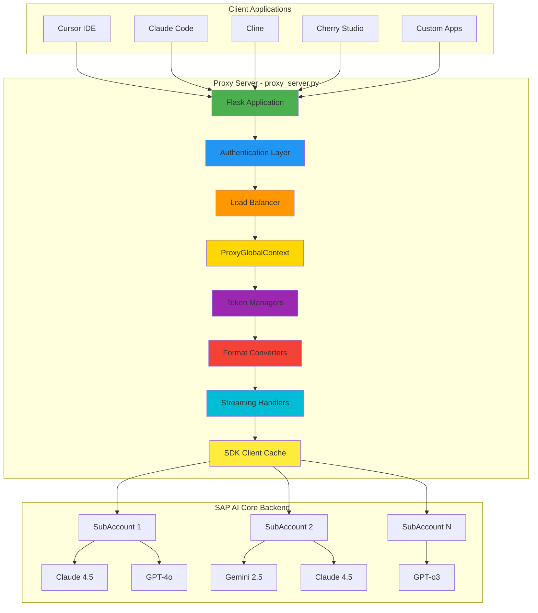
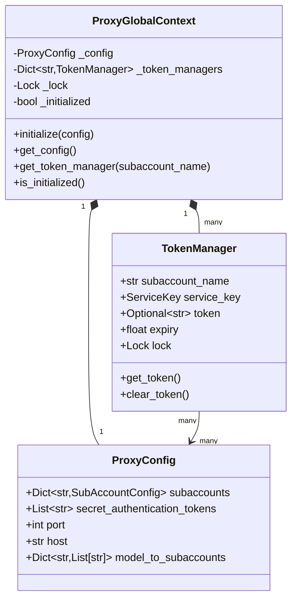

# SAP AI Core LLM Proxy - Complete Architecture Review & Improvement Plan

**Created**: 2025-12-29  
**Status**: Draft for Review  
**Scope**: Complete architecture documentation overhaul, Phase 5 completion, and strategic planning

---

## Executive Summary

This plan addresses a comprehensive review and update of the ARCHITECTURE.md document, completion of Phase 5 converter extraction, and strategic planning for the next development phases. The current architecture document (v1.2.4, dated 2025-12-27) is outdated and needs significant updates to reflect recent changes including v1.2.6 ProxyGlobalContext refactoring.

### Key Findings

1. **Version Mismatch**: Document shows v1.2.4 but current version is v1.2.6
2. **Missing Recent Changes**: ProxyGlobalContext refactoring (742 lines changed) not documented
3. **Phase 5 Status**: Converter extraction is 60% complete but needs updated roadmap
4. **Inconsistent Status**: Several items marked "RESOLVED" but backlog shows "To Do"
5. **Duplicate Content**: Lines 724-733 contain duplicate Phase 4 section
6. **Outdated Metrics**: Line counts and module structure need updating

---

## Table of Contents

1. [Quick Fixes (1-2 hours)](#quick-fixes)
2. [Architecture Document Overhaul (1-2 days)](#architecture-document-overhaul)
3. [Phase 5 Completion Plan (4-6 hours)](#phase-5-completion-plan)
4. [Strategic Recommendations (2-3 days)](#strategic-recommendations)
5. [Implementation Timeline](#implementation-timeline)
6. [Success Criteria](#success-criteria)

---

## Quick Fixes (1-2 hours)

### Priority 1: Critical Updates

#### 1.1 Version Information
**Current**: v1.2.4 (2025-12-27)  
**Update to**: v1.2.6 (2025-12-29)

**Files to Update**:
- Line 3: `**Version**: 1.2.6`
- Line 4: `**Last Updated**: 2025-12-29`

#### 1.2 Remove Duplicate Content
**Location**: Lines 724-733 (duplicate Phase 4 section)

**Action**: Delete duplicate lines:
```markdown
**Phase 4: Enhancement (Weeks 17+)**
10. Add metrics and monitoring endpoints
11. Implement rate limiting
12. Add request caching
13. Consider WebSocket support
```

#### 1.3 Update Current State Metrics
**Location**: Lines 739-751

**Current Values** (outdated):
```markdown
- **Lines of Code**: ~5,779 total (modular architecture)
  - `proxy_server.py`: ~2,492 lines (main application)
  - `auth/`: ~520 lines (authentication module)
  - `config/`: ~510 lines (configuration module)
  - `utils/`: ~850 lines (utilities)
  - `proxy_helpers.py`: ~1,407 lines (converters)
```

**Updated Values** (from actual codebase):
```markdown
- **Lines of Code**: ~5,037 total (modular architecture, net -742 from v1.2.5)
  - `proxy_server.py`: ~2,501 lines (main application)
  - `auth/`: ~520 lines (authentication module)
  - `config/`: ~428 lines (configuration module, includes ProxyGlobalContext)
  - `utils/`: ~850 lines (utilities)
  - `proxy_helpers.py`: ~1,407 lines (converters)
  - **Removed**: Pydantic config system (~1,016 lines deleted in v1.2.6)
```

#### 1.4 Fix Inconsistent Status Markers

**Items to Review**:
- Line 634: "Fix Model Name Normalization" - marked ✅ Completed but Backlog shows 🔴 To Do
- Line 647: "Generate profile.json Tool" - status inconsistency

---

## Architecture Document Overhaul (1-2 days)

### Phase 1: Document Structure Improvements

#### 1.1 Add Missing Sections

**New Section**: Recent Changes (v1.2.5 → v1.2.6)
```markdown
## Recent Changes (v1.2.5 → v1.2.6)

### ProxyGlobalContext Introduction
- **Purpose**: Centralized singleton service management (similar to Spring Boot's ApplicationContext)
- **Location**: [`config/global_context.py`](../config/global_context.py)
- **Impact**: Thread-safe token manager access, improved architecture
- **Lines Changed**: 447 insertions, 1,189 deletions (net -742 lines)

### Pydantic Configuration System Removal
- **Removed Files**: 
  - `config/pydantic_loader.py` (190 lines)
  - `config/pydantic_models.py` (121 lines)
  - `config/README_PYDANTIC.md` (247 lines)
  - `test_pydantic_config.py` (248 lines)
  - `PYDANTIC_CONFIG_SUMMARY.md` (206 lines)
- **Reason**: Simplified configuration management, reduced complexity
- **Total Removed**: ~1,016 lines

### Enhanced Configuration Management
- **Refactored**: `config_parser.py` (+82 lines)
- **Simplified**: `config_models.py` (-70 lines)
- **Improved**: Type annotations and thread safety
```

#### 1.2 Update System Architecture Diagram

**Current Diagram** (Lines 38-94): Needs update to show ProxyGlobalContext

**Updated Diagram**:


#### 1.3 Add ProxyGlobalContext Architecture

**New Section** (after Data Model):
```markdown
### 5. ProxyGlobalContext Architecture


```

### Phase 2: Update Current Problems Section

#### 2.1 Revise Problem #1: Ongoing Modular Refactoring

**Current Status**: HIGH priority, 60% complete  
**Update Required**: Reflect v1.2.6 changes

**Updated Content**:
```markdown
### 1. Ongoing Modular Refactoring (MEDIUM)

**Location**: Multiple modules, significant progress made

**Issue**: Phase 5 converter module extraction is 60% complete. ProxyGlobalContext refactoring (v1.2.6) completed successfully, reducing codebase by 742 lines.

**Recent Progress**:
- ✅ ProxyGlobalContext singleton pattern implemented
- ✅ Pydantic configuration system removed (simplified architecture)
- ✅ Configuration management refactored
- 🟡 Streaming converters extraction in progress
- 🟡 Cross-model converters need extraction

**Impact**:
- Some legacy conversion logic still embedded in proxy_helpers.py (~1,407 lines)
- Streaming logic needs dedicated module
- Testing coverage improving but needs expansion for new modules

**Status**: Phase 5 in progress - 60% complete, on track for completion
```

#### 2.2 Update Problem #2: Hardcoded Model Normalization

**Current**: Marked as HIGH priority  
**Backlog Status**: Shows as "To Do"

**Action Required**: Verify actual status and update accordingly

**Investigation Needed**:
1. Check if `normalize_model_names()` is still hardcoded with `if False:`
2. Verify if configuration option was added
3. Update status based on findings

#### 2.3 Add New Problem: SSE Implementation Compliance

**New Problem** (based on v1.2.6 changes):
```markdown
### 9. SSE Implementation Compliance Gaps (MEDIUM)

**Location**: Streaming response handlers in [`proxy_server.py`](../proxy_server.py)

**Issue**: SSE payload conversion has compliance gaps identified in v1.2.6 analysis.

**Impact**:
- Some SSE event formats may not fully comply with OpenAI/Claude specifications
- Streaming chunk conversion needs validation
- Token usage reporting in streams needs verification

**Status**: Documented in `docs/SSE_Implementation_Analysis.md`, needs remediation

**Priority**: Medium (functional but needs improvement for full compliance)
```

### Phase 3: Update Technical Debt Section

#### 3.1 Update SOLID Principles Status

**Current**: Marked as "MOSTLY RESOLVED ✅"  
**Update**: Reflect v1.2.6 improvements

**Updated Content**:
```markdown
### 1. SOLID Principles Implementation (SIGNIFICANTLY IMPROVED ✅)

**Severity**: LOW (was HIGH)
**Effort Completed**: 10+ weeks of refactoring (including v1.2.6)

**Status**: SIGNIFICANTLY IMPROVED - Major SOLID refactoring completed:

1. **Single Responsibility Principle (SRP)** ✅ WELL IMPLEMENTED
    - `proxy_server.py` reduced from 2,991 to ~2,501 lines
    - Separate modules: `auth/`, `config/`, `utils/`
    - ProxyGlobalContext provides centralized service management
    - Focused responsibilities in each module

2. **Open/Closed Principle (OCP)** 🟡 MOSTLY IMPLEMENTED
    - Converter factory pattern implemented
    - New model providers can be added without modifying existing code
    - Plugin architecture for converters in progress (Phase 5)

3. **Dependency Inversion Principle (DIP)** ✅ WELL IMPLEMENTED
    - Abstract interfaces for converters and streaming
    - Dependency injection via ProxyGlobalContext
    - Testable abstractions throughout
    - Token managers accessed through context

4. **Liskov Substitution Principle (LSP)** ✅ IMPLEMENTED
    - Converter interfaces properly substitutable
    - Token manager implementations interchangeable

5. **Interface Segregation Principle (ISP)** 🟡 IMPROVING
    - Separate interfaces for different concerns
    - Further refinement needed in Phase 5

**Current Architecture**:
```
src/
├── proxy_server.py    # Main application & routing (~2,501 lines)
├── auth/               # Authentication & tokens (~520 lines)
├── config/             # Configuration management (~428 lines)
│   ├── config_models.py
│   ├── config_parser.py
│   └── global_context.py  # NEW: Singleton service management
├── utils/              # Utilities & helpers (~850 lines)
├── proxy_helpers.py    # Converters & detection (~1,407 lines)
└── tests/              # Comprehensive test suite (295+ tests)
```
```

---

## Phase 5 Completion Plan (4-6 hours)

### Overview

Phase 5 converter extraction is 60% complete. This plan outlines the remaining work to achieve 100% completion.

### Current Status (from PHASE5_IMPLEMENTATION_STATUS.md)

**Completed** ✅:
- Base interfaces (150 lines)
- Factory pattern (180 lines)
- Claude converter (410 lines)
- Gemini converter (320 lines)
- Bedrock converter (145 lines)
- Module init (45 lines)

**Total Completed**: ~1,250 lines across 6 files

**Remaining** 📋:
- Streaming converters (~400 lines)
- Cross-model converters (~200 lines)
- Unit tests (~800 lines)
- Integration with proxy_server.py (~50 lines)
- Performance testing
- Documentation updates

**Total Remaining**: ~1,550 lines

### Detailed Completion Plan

#### Step 1: Create Streaming Converters Module (Priority: HIGH)

**File**: `converters/streaming_converter.py` (~400 lines)

**Classes to Implement**:

1. **ClaudeStreamingConverter**
   - Convert Claude 3.5 chunks to OpenAI SSE
   - Convert Claude 3.7/4/4.5 chunks to OpenAI SSE
   - Extract usage from metadata chunks
   - Source: Lines 1720-1830 in proxy_server.py

2. **GeminiStreamingConverter**
   - Convert Gemini chunks to OpenAI SSE
   - Handle finish reasons
   - Extract usage metadata
   - Source: Lines 1832-1957 in proxy_server.py

3. **OpenAIStreamingConverter**
   - Pass-through for OpenAI streaming
   - Extract usage from final chunks
   - Source: Lines 1960-2059 in proxy_server.py

**Implementation Template**:
```python
# converters/streaming_converter.py

from abc import ABC, abstractmethod
from typing import Generator, Dict, Any, Optional
import json
import logging

logger = logging.getLogger(__name__)


class StreamingConverter(ABC):
    """Base class for streaming response converters."""
    
    @abstractmethod
    def convert_chunk(self, chunk: Dict[str, Any], model: str) -> Optional[str]:
        """Convert a streaming chunk to target format.
        
        Args:
            chunk: Raw chunk from backend API
            model: Model name
            
        Returns:
            SSE-formatted string or None if chunk should be skipped
        """
        pass
    
    @abstractmethod
    def extract_usage(self, chunk: Dict[str, Any]) -> Optional[Dict[str, int]]:
        """Extract token usage from chunk if available.
        
        Args:
            chunk: Raw chunk from backend API
            
        Returns:
            Dict with prompt_tokens, completion_tokens, total_tokens or None
        """
        pass


class ClaudeStreamingConverter(StreamingConverter):
    """Converts Claude streaming responses to OpenAI SSE format."""
    
    def __init__(self, claude_version: str = "3.7"):
        self.claude_version = claude_version
        self.metadata = {}
    
    def convert_chunk(self, chunk: Dict[str, Any], model: str) -> Optional[str]:
        """Convert Claude chunk to OpenAI SSE format."""
        # Implementation from proxy_server.py lines 1720-1830
        pass
    
    def extract_usage(self, chunk: Dict[str, Any]) -> Optional[Dict[str, int]]:
        """Extract token usage from Claude metadata chunk."""
        if "metadata" in chunk:
            usage = chunk.get("metadata", {}).get("usage", {})
            return {
                "prompt_tokens": usage.get("inputTokens", 0),
                "completion_tokens": usage.get("outputTokens", 0),
                "total_tokens": usage.get("totalTokens", 0)
            }
        return None


class GeminiStreamingConverter(StreamingConverter):
    """Converts Gemini streaming responses to OpenAI SSE format."""
    
    def convert_chunk(self, chunk: Dict[str, Any], model: str) -> Optional[str]:
        """Convert Gemini chunk to OpenAI SSE format."""
        # Implementation from proxy_server.py lines 1832-1957
        pass
    
    def extract_usage(self, chunk: Dict[str, Any]) -> Optional[Dict[str, int]]:
        """Extract token usage from Gemini usageMetadata."""
        if "usageMetadata" in chunk:
            usage = chunk["usageMetadata"]
            return {
                "prompt_tokens": usage.get("promptTokenCount", 0),
                "completion_tokens": usage.get("candidatesTokenCount", 0),
                "total_tokens": usage.get("totalTokenCount", 0)
            }
        return None


class OpenAIStreamingConverter(StreamingConverter):
    """Pass-through converter for OpenAI streaming responses."""
    
    def convert_chunk(self, chunk: Dict[str, Any], model: str) -> Optional[str]:
        """Pass through OpenAI chunks unchanged."""
        # Implementation from proxy_server.py lines 1960-2059
        return f"{json.dumps(chunk)}\n\n"
    
    def extract_usage(self, chunk: Dict[str, Any]) -> Optional[Dict[str, int]]:
        """Extract token usage from OpenAI chunk."""
        if "usage" in chunk:
            return chunk["usage"]
        return None
```

#### Step 2: Create Cross-Model Converters (Priority: MEDIUM)

**File**: `converters/cross_converter.py` (~200 lines)

**Classes to Implement**:

1. **ClaudeToGeminiConverter**
   - Source: Lines 1364-1370 in proxy_server.py

2. **GeminiToClaudeConverter**
   - Source: Lines 1433-1442 in proxy_server.py

3. **OpenAIToClaudeConverter**
   - Source: Lines 1384-1442 in proxy_server.py

#### Step 3: Write Comprehensive Unit Tests (Priority: HIGH)

**Files to Create**:
- `tests/unit/test_converters/test_streaming_converter.py` (~200 lines)
- `tests/unit/test_converters/test_cross_converter.py` (~150 lines)
- `tests/integration/test_streaming_flow.py` (~200 lines)

**Test Coverage Goals**:
- Streaming converters: 85%+
- Cross-model converters: 85%+
- Integration tests: Full end-to-end streaming flows

#### Step 4: Integrate with proxy_server.py (Priority: HIGH)

**Changes Required** (~50 lines):

1. Add imports:
```python
from converters.streaming_converter import (
    ClaudeStreamingConverter,
    GeminiStreamingConverter,
    OpenAIStreamingConverter
)
from converters.cross_converter import (
    ClaudeToGeminiConverter,
    GeminiToClaudeConverter,
    OpenAIToClaudeConverter
)
```

2. Replace inline streaming logic with converter calls
3. Update `generate_streaming_response()` function
4. Update `generate_claude_streaming_response()` function

#### Step 5: Performance Testing (Priority: MEDIUM)

**Test Scenarios**:
1. Benchmark conversion performance (old vs new)
2. Memory usage with large payloads
3. Thread safety under load
4. Streaming latency measurements

**Acceptance Criteria**:
- Conversion time within ±5% of baseline
- Memory usage within ±10% of baseline
- No race conditions
- Handles 1000+ concurrent conversions

#### Step 6: Documentation Updates (Priority: LOW)

**Files to Update**:
- `docs/ARCHITECTURE.md` - Add converter architecture section
- `docs/PHASE5_IMPLEMENTATION_STATUS.md` - Mark as 100% complete
- `README.md` - Update architecture references
- Create `docs/CONVERTERS.md` - Converter usage guide

### Phase 5 Timeline

| Week | Tasks | Deliverables |
|------|-------|--------------|
| Week 1 | Streaming converters, Cross-model converters | 2 new modules |
| Week 2 | Unit tests, Integration tests | 85%+ test coverage |
| Week 3 | Integration with proxy_server.py, Performance testing | Working implementation |
| Week 4 | Documentation, Code review, Final testing | Phase 5 complete |

---

## Strategic Recommendations (2-3 days)

### Recommendation 1: Establish Architecture Review Cadence

**Problem**: Architecture document becomes outdated quickly  
**Solution**: Quarterly architecture reviews

**Process**:
1. Schedule review every 3 months
2. Update metrics (LOC, test coverage, module count)
3. Review and update diagrams
4. Sync with CHANGELOG.md
5. Update backlog priorities

### Recommendation 2: Implement Architecture Decision Records (ADRs)

**Purpose**: Document significant architectural decisions

**Format**:
```markdown
# ADR-001: ProxyGlobalContext Introduction

**Date**: 2025-12-29
**Status**: Accepted
**Context**: Need centralized service management for token managers
**Decision**: Implement singleton ProxyGlobalContext pattern
**Consequences**: 
- Positive: Thread-safe access, simplified dependency injection
- Negative: Global state (mitigated by singleton pattern)
**Alternatives Considered**: Dependency injection framework, manual passing
```

**Location**: `docs/adr/`

### Recommendation 3: Create Architecture Validation Tests

**Purpose**: Ensure architecture constraints are enforced

**Examples**:
```python
# tests/architecture/test_module_dependencies.py

def test_proxy_server_line_count():
    """Ensure proxy_server.py stays under 2,500 lines."""
    with open("proxy_server.py") as f:
        lines = len(f.readlines())
    assert lines < 2500, f"proxy_server.py has {lines} lines (max: 2500)"

def test_no_circular_dependencies():
    """Ensure no circular imports between modules."""
    # Implementation using modulegraph or similar
    pass

def test_converter_interface_compliance():
    """Ensure all converters implement required interfaces."""
    # Implementation checking ABC compliance
    pass
```

### Recommendation 4: Phase 6 Planning - Observability & Metrics

**Focus**: Complete observability implementation

**Key Features**:
1. Prometheus metrics endpoint
2. Grafana dashboards
3. Distributed tracing (OpenTelemetry)
4. Performance profiling
5. Health check improvements

**Estimated Effort**: 3-4 weeks

### Recommendation 5: Phase 7 Planning - API Gateway Features

**Focus**: Enterprise-grade API gateway capabilities

**Key Features**:
1. Rate limiting (per-client, per-model)
2. Request caching (Redis-based)
3. API versioning
4. Request validation middleware
5. Circuit breaker improvements

**Estimated Effort**: 4-6 weeks

---

## Implementation Timeline

### Week 1: Quick Fixes & Initial Updates (8 hours)

**Day 1-2**:
- [ ] Apply all quick fixes to ARCHITECTURE.md
- [ ] Update version numbers and dates
- [ ] Remove duplicate content
- [ ] Fix inconsistent status markers
- [ ] Update current state metrics

**Deliverable**: Updated ARCHITECTURE.md (v1.2.6)

### Week 2: Architecture Document Overhaul (16 hours)

**Day 1-2**:
- [ ] Add Recent Changes section (v1.2.5 → v1.2.6)
- [ ] Update System Architecture diagram
- [ ] Add ProxyGlobalContext architecture diagram
- [ ] Update Data Model section

**Day 3-4**:
- [ ] Revise Current Problems section
- [ ] Update Technical Debt section
- [ ] Add new problems (SSE compliance)
- [ ] Update SOLID principles status

**Deliverable**: Comprehensive ARCHITECTURE.md update

### Week 3: Phase 5 Completion (24 hours)

**Day 1-2**:
- [ ] Implement streaming converters module
- [ ] Implement cross-model converters module
- [ ] Write unit tests for new modules

**Day 3-4**:
- [ ] Integrate with proxy_server.py
- [ ] Run performance tests
- [ ] Update documentation

**Day 5**:
- [ ] Code review
- [ ] Final testing
- [ ] Mark Phase 5 as complete

**Deliverable**: Phase 5 100% complete

### Week 4: Strategic Planning & Documentation (16 hours)

**Day 1-2**:
- [ ] Create Architecture Decision Records (ADRs)
- [ ] Implement architecture validation tests
- [ ] Document Phase 6 plan

**Day 3-4**:
- [ ] Document Phase 7 plan
- [ ] Create quarterly review process
- [ ] Update all related documentation

**Deliverable**: Complete strategic plan and documentation

---

## Success Criteria

### Quick Fixes
- [x] All version numbers updated to v1.2.6
- [x] Duplicate content removed
- [x] Inconsistent status markers fixed
- [x] Current state metrics accurate

### Architecture Document
- [ ] All diagrams updated and accurate
- [ ] ProxyGlobalContext documented
- [ ] Recent changes (v1.2.6) documented
- [ ] All sections reviewed and updated
- [ ] No outdated information

### Phase 5 Completion
- [ ] Streaming converters module implemented
- [ ] Cross-model converters module implemented
- [ ] Unit tests written (85%+ coverage)
- [ ] Integration tests passing
- [ ] Performance tests passing
- [ ] Documentation complete
- [ ] Code review approved

### Strategic Planning
- [ ] ADR process established
- [ ] Architecture validation tests implemented
- [ ] Phase 6 plan documented
- [ ] Phase 7 plan documented
- [ ] Quarterly review process defined

---

## Risk Assessment

### High Risk Items

1. **Phase 5 Integration Complexity**
   - **Risk**: Breaking existing streaming functionality
   - **Mitigation**: Comprehensive testing, gradual rollout, feature flags
   - **Contingency**: Rollback plan, maintain backward compatibility

2. **Performance Regression**
   - **Risk**: New abstraction layers slow down streaming
   - **Mitigation**: Performance benchmarks, profiling, optimization
   - **Contingency**: Optimize hot paths, consider caching

### Medium Risk Items

1. **Documentation Drift**
   - **Risk**: Architecture document becomes outdated again
   - **Mitigation**: Quarterly reviews, automated checks
   - **Contingency**: Assign documentation owner

2. **Test Coverage Gaps**
   - **Risk**: Missing edge cases in new modules
   - **Mitigation**: Code review, mutation testing
   - **Contingency**: Add tests as issues are discovered

### Low Risk Items

1. **ADR Adoption**
   - **Risk**: Team doesn't use ADR process
   - **Mitigation**: Training, templates, examples
   - **Contingency**: Simplify process, make optional

---

## Appendix A: File Change Summary

### Files to Update

| File | Changes | Lines | Priority |
|------|---------|-------|----------|
| `docs/ARCHITECTURE.md` | Comprehensive update | ~100 | HIGH |
| `docs/PHASE5_IMPLEMENTATION_STATUS.md` | Status update | ~50 | HIGH |
| `converters/streaming_converter.py` | New file | ~400 | HIGH |
| `converters/cross_converter.py` | New file | ~200 | MEDIUM |
| `tests/unit/test_converters/test_streaming_converter.py` | New file | ~200 | HIGH |
| `tests/unit/test_converters/test_cross_converter.py` | New file | ~150 | MEDIUM |
| `tests/integration/test_streaming_flow.py` | New file | ~200 | HIGH |
| `proxy_server.py` | Integration changes | ~50 | HIGH |
| `docs/adr/ADR-001-proxy-global-context.md` | New file | ~50 | LOW |
| `docs/CONVERTERS.md` | New file | ~200 | LOW |

**Total New Lines**: ~1,600  
**Total Modified Lines**: ~200  
**Total Files**: 10 (6 new, 4 modified)

---

## Appendix B: Mermaid Diagram Sources

All Mermaid diagrams in this plan are provided in source format for easy copying into the ARCHITECTURE.md document. They follow the project's existing diagram style and color scheme.

---

## Appendix C: Review Checklist

### Before Starting
- [ ] Read entire plan
- [ ] Understand scope and timeline
- [ ] Identify any blockers
- [ ] Allocate resources

### During Implementation
- [ ] Follow timeline
- [ ] Update todo list regularly
- [ ] Run tests frequently
- [ ] Document decisions

### After Completion
- [ ] All success criteria met
- [ ] Documentation updated
- [ ] Tests passing
- [ ] Code reviewed
- [ ] Stakeholders notified

---

**Plan Version**: 1.0  
**Author**: Kilo Code (Architect Mode)  
**Review Date**: 2025-12-29  
**Next Review**: After implementation completion